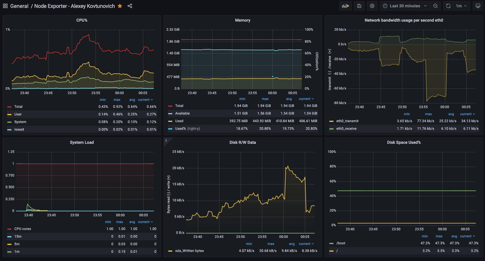

# HW15 - Настройка мониторинга

## Задача

- развернуть стенд с prometheus, grafana и node-exporter
- в grafana настроить дашборд с 4-мя графиками
  - память
  - процессор
  - диск
  - сеть

## Выполение ДЗ

- развернем стенд с автоматической установкой prometheus, grafana и node-exporter

```bash
vagrant up
```

- далее заходим в [grafana](http://127.0.0.1:3000), создаем Data Source и импортируем наш созданный [дашборд](dashboard.json)


