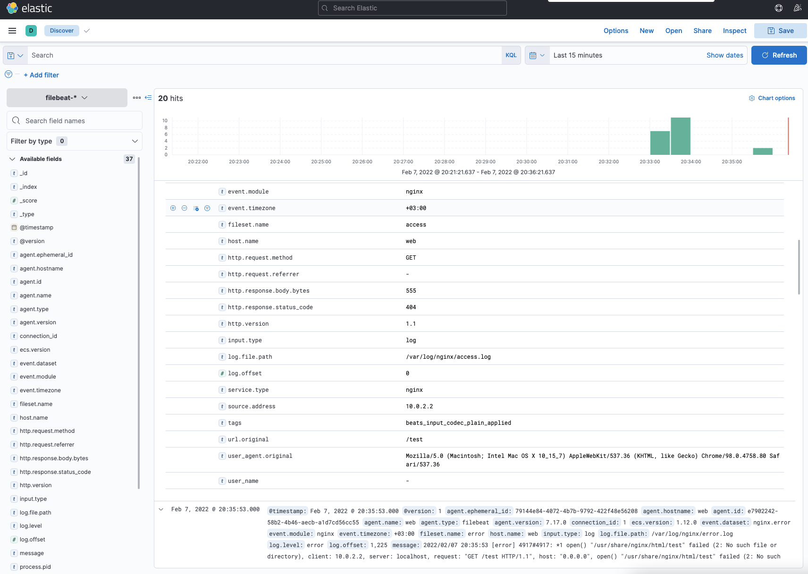

# Настраиваем центральный сервер сбор логов

## Введени

Функция системного журналирования (логирование) – это основной источник информации о работе системы и ошибках.
В системе Linux почти все действия записываются. Именно эти данные помогают разбираться в проблемах с ОС.

Логи могут храниться как локально, так и пересылаться на удаленную систему. Пересылка логов имеет следующие
плюсы:

- Возможность централизованного сбора и анализа логов. Все логи со всех устройств прилетают в одно место. Это значительно упростит работу с логами.
- Защита от удаления логов на локальной машине.
- Оптимизация места на диске в локальной ОС. Логи не будут храниться в ОС, т.к. будут сразу пересылаться в систему сбора логов. Данная функция настраивается отдельно.

В ОС Linux главным файлом локального журналирования является:

- Ubuntu/Debian — /var/log/syslog
- RHEL/CentOS — /var/log/messages

Логи в ОС можно настроить. Например, указывать больше информации или отключить логирование конкретного компонента.

Помимо логов, в Unix-системах используют аудит.  
В linux эту функцию выполнеят linux audit daemon.

Linux Audit Daemon – это среда, позволяющая проводить аудит событий в системе Linux. Используя мощную систему аудита возможно отслеживать многие типы событий для
мониторинга и проверки системы, например:

- доступ к файлам;
- изменение прав на файлы;
- просмотр пользователей, изменивших конкретный файл;
- обнаружение несанкционированных изменений;
- мониторинг системных вызовов и функций;
- обнаружение аномалий, таких как сбои;
- мониторинг набора команд.

Аудит различает 4 вида доступа к файлу:

- r — чтение
- w — запись в файл
- x — выполнение файла
- a — изменение атрибута

Для выполнения задания потребуется:

ПК на Unix c 8ГБ ОЗУ или виртуальная машина с включенной Nested Virtualization. Предварительно установленное и настроенное следующее ПО:

1. Hashicorp Vagrant <https://www.vagrantup.com/downloads>
2. Oracle VirtualBox <https://www.virtualbox.org/wiki/Linux_Downloads>
3. Ansible (версия 2.7 и выше) <https://docs.ansible.com/ansible/latest/installation_guide/intro_installation.html>

## Цели домашнего задания

1. Научится проектировать централизованный сбор логов.
2. Рассмотреть особенности разных платформ для сбора логов.

## Описание домашнего задания

1. В Vagrant разворачиваем 2 виртуальные машины web и log
2. на web настраиваем nginx
3. на log настраиваем центральный лог сервер на любой системе на выбор: journald, rsyslog, elk.
4. настраиваем аудит, следящий за изменением конфигов nginx

Все критичные логи с web должны собираться и локально и удаленно. Все логи с nginx должны уходить на удаленный сервер (локально только критичные).
Логи аудита должны также уходить на удаленную систему.

Формат сдачи ДЗ - vagrant + ansible

Дополнительное задание:

- развернуть еще машину с elk
- таким образом настроить 2 центральных лог системы elk и какую либо еще;
- в elk должны уходить только логи нжинкса;
- во вторую систему все остальное.

## Пошаговая инструкция выполнения домашнего задания

### Создаём виртуальные машины

- Создаём каталог, в котором будут храниться настройки виртуальной машины. В каталоге создаём файл с именем [Vagrantfile](./Vagrantfile)
- Результатом выполнения команды vagrant up станут 2 созданные виртуальные машины
- Заходим на web-сервер: vagrant ssh web

> Дальнейшие действия выполняются от пользователя root

- Переходим в root пользователя

```bash
sudo -i
```

- Для правильной работы c логами, нужно, чтобы на всех хостах было настроено одинаковое время. Укажем часовой пояс (Московское время)

```bash
\cp /usr/share/zoneinfo/Europe/Moscow /etc/localtime
```

- Перезупустим службу NTP Chrony:

```bash
systemctl restart chronyd
```

- Проверим, что служба работает корректно:

```bash
systemctl status chronyd

● chronyd.service - NTP client/server
   Loaded: loaded (/usr/lib/systemd/system/chronyd.service; enabled; vendor preset: enabled)
   Active: active (running) since Tue 2022-02-01 23:07:32 MSK; 4s ago
     Docs: man:chronyd(8)
           man:chrony.conf(5)
  Process: 3269 ExecStartPost=/usr/libexec/chrony-helper update-daemon (code=exited, status=0/SUCCESS)
  Process: 3265 ExecStart=/usr/sbin/chronyd $OPTIONS (code=exited, status=0/SUCCESS)
 Main PID: 3267 (chronyd)
   CGroup: /system.slice/chronyd.service
           └─3267 /usr/sbin/chronyd

Feb 01 23:07:32 web systemd[1]: Stopped NTP client/server.
Feb 01 23:07:32 web systemd[1]: Starting NTP client/server...
Feb 01 23:07:32 web chronyd[3267]: chronyd version 3.4 starting (+CMDMON +NTP +REFCLOCK +RTC +PRIVDROP +SCFILTER +SIGND +ASYNCDNS +SECHASH +IPV6 +DEBUG)
Feb 01 23:07:32 web chronyd[3267]: Frequency -24.463 +/- 2.561 ppm read from /var/lib/chrony/drift
Feb 01 23:07:32 web systemd[1]: Started NTP client/server.
Feb 01 23:07:37 web chronyd[3267]: Selected source 85.21.78.23
```

- Далее проверим, что время и дата указаны правильно

```bash
date
```

> Настроить NTP нужно на обоих серверах

### Установка nginx на виртуальной машине web

- Для установки nginx сначала нужно установить epel-release

```bash
yum install epel-release -y
```

- Установим nginx

```bash
yum install -y nginx
systemctl enable nginx
systemctl start nginx
```

- Проверим, что nginx работает корректно

```bash
systemctl status nginx

● nginx.service - The nginx HTTP and reverse proxy server
   Loaded: loaded (/usr/lib/systemd/system/nginx.service; enabled; vendor preset: disabled)
   Active: active (running) since Tue 2022-02-01 23:10:39 MSK; 2min 12s ago
  Process: 3531 ExecStart=/usr/sbin/nginx (code=exited, status=0/SUCCESS)
  Process: 3529 ExecStartPre=/usr/sbin/nginx -t (code=exited, status=0/SUCCESS)
  Process: 3528 ExecStartPre=/usr/bin/rm -f /run/nginx.pid (code=exited, status=0/SUCCESS)
 Main PID: 3533 (nginx)
   CGroup: /system.slice/nginx.service
           ├─3533 nginx: master process /usr/sbin/nginx
           └─3534 nginx: worker process

Feb 01 23:10:39 web systemd[1]: Starting The nginx HTTP and reverse proxy server...
Feb 01 23:10:39 web nginx[3529]: nginx: the configuration file /etc/nginx/nginx.conf syntax is ok
Feb 01 23:10:39 web nginx[3529]: nginx: configuration file /etc/nginx/nginx.conf test is successful
Feb 01 23:10:39 web systemd[1]: Started The nginx HTTP and reverse proxy server.

ss -tln | grep 80

LISTEN     0      128          *:80                       *:*                  
LISTEN     0      128       [::]:80                    [::]:* 
```

> Также работу nginx можно проверить на хосте. В браузере ввведем в адерсную строку <http://192.168.50.10>

### Настройка центрального сервера сбора логов

- Откроем ещё одно окно терминала и подключимся по ssh к ВМ log: vagrant ssh log
- Перейдем в пользователя root: sudo -i
- rsyslog должен быть установлен по умолчанию в нашей ОС, проверим это

```bash
yum list rsyslog
...
Installed Packages
rsyslog.x86_64                                   8.24.0-52.el7                                        @anaconda
Available Packages
rsyslog.x86_64                                   8.24.0-57.el7_9.1                                    updates 
```

> Все настройки Rsyslog хранятся в файле /etc/rsyslog.conf

Для того, чтобы наш сервер мог принимать логи, нам необходимо внести следующие изменения в файл:

- Открываем порт 514 (TCP и UDP) и Находим закомментированные строки

```bash
# Provides UDP syslog reception
#$ModLoad imudp
#$UDPServerRun 514

# Provides TCP syslog reception
#$ModLoad imtcp
#$InputTCPServerRun 514
```

- И приводим их к виду

```bash
# Provides UDP syslog reception
$ModLoad imudp
$UDPServerRun 514

# Provides TCP syslog reception
$ModLoad imtcp
$InputTCPServerRun 514
```

- В конец файла /etc/rsyslog.conf добавляем правила приёма сообщений от хостов

```bash
$template RemoteLogs,"/var/log/rsyslog/%HOSTNAME%/%PROGRAMNAME%.log"
*.* ?RemoteLogs
& ~
```

> Данные параметры будут отправлять в папку /var/log/rsyslog логи, которые будут приходить от других серверов. Например, Access-логи nginx от сервера web, будут идти в файл /var/log/rsyslog/web/nginx_access.log

- Далее сохраняем файл и перезапускаем службу rsyslog

```bash
systemctl restart rsyslog
```

- Если ошибок не допущено, то у нас будут видны открытые порты TCP,UDP 514

```bash
ss -tuln | grep 514
udp    UNCONN     0      0         *:514                   *:*                  
udp    UNCONN     0      0      [::]:514                [::]:*                  
tcp    LISTEN     0      25        *:514                   *:*                  
tcp    LISTEN     0      25     [::]:514                [::]:* 
```

### Далее настроим отправку логов с web-сервера

- Заходим на web сервер: vagrant ssh web
- Переходим в root пользователя: sudo -i
- Проверим версию nginx
- Находим в файле /etc/nginx/nginx.conf раздел с логами и приводим их к следующему виду

```bash
error_log /var/log/nginx/error.log;
error_log syslog:server=192.168.50.11:514,tag=nginx_error;

http {
    access_log syslog:server=192.168.50.11:514,tag=nginx_access,severity=info combined;
```

Для Access-логов указываем удаленный сервер и уровень логов, которые нужно отправлять. Для error_log добавляем удаленный сервер. Если требуется чтобы логи хранились локально и отправлялись
на удаленный сервер, требуется указать 2 строки. Tag нужен для того, чтобы логи записывались в разные файлы.

По умолчанию, error-логи отправляют логи, которые имеют severity: error, crit, alert и emerg. Если трубуется хранили или пересылать логи с другим severity, то это также можно указать в
настройках nginx.

- Далее проверяем, что конфигурация nginx указана правильно: nginx -t

```bash
nginx -t
nginx: the configuration file /etc/nginx/nginx.conf syntax is ok
nginx: configuration file /etc/nginx/nginx.conf test is successful
```

- Далее перезапустим nginx: systemctl restart nginx

- Чтобы проверить, что логи ошибок также улетают на удаленный сервер, можно удалить картинку, к которой будет обращаться nginx во время открытия веб-сраницы

```bash
rm -f /usr/share/nginx/html/img/header-background.png
```

- Попробуем несколько раз зайти по адресу <http://192.168.50.10>
- Далее заходим на log-сервер и смотрим информацию об nginx

```bash
cat /var/log/rsyslog/web/nginx_access.log
Feb  1 23:35:43 web nginx_access: 127.0.0.1 - - [01/Feb/2022:23:35:43 +0300] "GET / HTTP/1.1" 200 4833 "-" "curl/7.29.0"
Feb  1 23:35:44 web nginx_access: 127.0.0.1 - - [01/Feb/2022:23:35:44 +0300] "GET / HTTP/1.1" 200 4833 "-" "curl/7.29.0"
Feb  1 23:35:44 web nginx_access: 127.0.0.1 - - [01/Feb/2022:23:35:44 +0300] "GET / HTTP/1.1" 200 4833 "-" "curl/7.29.0"
Feb  1 23:35:45 web nginx_access: 127.0.0.1 - - [01/Feb/2022:23:35:45 +0300] "GET / HTTP/1.1" 200 4833 "-" "curl/7.29.0"

cat /var/log/rsyslog/web/nginx_error.log
Feb  1 23:38:57 web nginx_error: 2022/02/01 23:38:57 [error] 694#694: *1 open() "/usr/share/nginx/html/img/header-background.png" failed (2: No such file or directory), client: 10.0.2.2, server: _, request: "GET /img/header-background.png HTTP/1.1", host: "localhost", referrer: "http://localhost/"
Feb  1 23:39:45 web nginx_error: 2022/02/01 23:39:45 [error] 694#694: *1 open() "/usr/share/nginx/html/img/header-background.png" failed (2: No such file or directory), client: 10.0.2.2, server: _, request: "GET /img/header-background.png HTTP/1.1", host: "localhost", referrer: "http://localhost/"
```

> Видим, что логи отправляются корректно.

### Настройка аудита, контролирующего изменения конфигурации nginx

- За аудит отвечает утилита auditd, в RHEL-based системах обычно он уже предустановлен. Проверим это

```bash
rpm -qa | grep audit
audit-2.8.5-4.el7.x86_64
audit-libs-2.8.5-4.el7.x86_64
```

> Настроим аудит изменения конфигурации nginx

- Добавим правило, которое будет отслеживать изменения в конфигруации nginx. Для этого в конец файла /etc/audit/rules.d/audit.rules добавим следующие строки:

```bash
-w /etc/nginx/nginx.conf -p wa -k nginx_conf
-w /etc/nginx/default.d/ -p wa -k nginx_conf
```

Данные правила позволяют контролировать запись (w) и измения атрибутов (a) в:

- /etc/nginx/nginx.conf
- Всех файлов каталога /etc/nginx/default.d/

> Для более удобного поиска к событиям добавляется метка nginx_conf

- Перезапускаем службу auditd: service auditd restart
- После данных изменений у нас начнут локально записываться логи аудита. Чтобы проверить, что логи аудита начали записываться локально, нужно внести изменения в файл /etc/nginx/nginx.conf или поменять его атрибут, потом посмотреть информацию об изменениях

```bash
ausearch -k nginx_conf -f /etc/nginx/nginx.conf

----
time->Tue Feb  1 23:50:09 2022
type=CONFIG_CHANGE msg=audit(1643748609.506:630): auid=1000 ses=3 op=updated_rules path="/etc/nginx/nginx.conf" key="nginx_conf" list=4 res=1
----
time->Tue Feb  1 23:50:09 2022
type=PROCTITLE msg=audit(1643748609.506:631): proctitle=7669002F6574632F6E67696E782F6E67696E782E636F6E66
type=PATH msg=audit(1643748609.506:631): item=3 name="/etc/nginx/nginx.conf~" inode=12492 dev=08:01 mode=0100644 ouid=0 ogid=0 rdev=00:00 obj=system_u:object_r:httpd_config_t:s0 objtype=CREATE cap_fp=0000000000000000 cap_fi=0000000000000000 cap_fe=0 cap_fver=0
type=PATH msg=audit(1643748609.506:631): item=2 name="/etc/nginx/nginx.conf" inode=12492 dev=08:01 mode=0100644 ouid=0 ogid=0 rdev=00:00 obj=system_u:object_r:httpd_config_t:s0 objtype=DELETE cap_fp=0000000000000000 cap_fi=0000000000000000 cap_fe=0 cap_fver=0
type=PATH msg=audit(1643748609.506:631): item=1 name="/etc/nginx/" inode=85 dev=08:01 mode=040755 ouid=0 ogid=0 rdev=00:00 obj=system_u:object_r:httpd_config_t:s0 objtype=PARENT cap_fp=0000000000000000 cap_fi=0000000000000000 cap_fe=0 cap_fver=0
type=PATH msg=audit(1643748609.506:631): item=0 name="/etc/nginx/" inode=85 dev=08:01 mode=040755 ouid=0 ogid=0 rdev=00:00 obj=system_u:object_r:httpd_config_t:s0 objtype=PARENT cap_fp=0000000000000000 cap_fi=0000000000000000 cap_fe=0 cap_fver=0
type=CWD msg=audit(1643748609.506:631):  cwd="/root"
type=SYSCALL msg=audit(1643748609.506:631): arch=c000003e syscall=82 success=yes exit=0 a0=139c9d0 a1=13a92d0 a2=fffffffffffffe80 a3=7ffecc1f1c20 items=4 ppid=2270 pid=2425 auid=1000 uid=0 gid=0 euid=0 suid=0 fsuid=0 egid=0 sgid=0 fsgid=0 tty=pts0 ses=3 comm="vi" exe="/usr/bin/vi" subj=unconfined_u:unconfined_r:unconfined_t:s0-s0:c0.c1023 key="nginx_conf"
----
time->Tue Feb  1 23:50:09 2022
type=CONFIG_CHANGE msg=audit(1643748609.506:632): auid=1000 ses=3 op=updated_rules path="/etc/nginx/nginx.conf" key="nginx_conf" list=4 res=1
----
time->Tue Feb  1 23:50:09 2022
type=PROCTITLE msg=audit(1643748609.506:633): proctitle=7669002F6574632F6E67696E782F6E67696E782E636F6E66
type=PATH msg=audit(1643748609.506:633): item=1 name="/etc/nginx/nginx.conf" inode=11553 dev=08:01 mode=0100644 ouid=0 ogid=0 rdev=00:00 obj=unconfined_u:object_r:httpd_config_t:s0 objtype=CREATE cap_fp=0000000000000000 cap_fi=0000000000000000 cap_fe=0 cap_fver=0
type=PATH msg=audit(1643748609.506:633): item=0 name="/etc/nginx/" inode=85 dev=08:01 mode=040755 ouid=0 ogid=0 rdev=00:00 obj=system_u:object_r:httpd_config_t:s0 objtype=PARENT cap_fp=0000000000000000 cap_fi=0000000000000000 cap_fe=0 cap_fver=0
type=CWD msg=audit(1643748609.506:633):  cwd="/root"
type=SYSCALL msg=audit(1643748609.506:633): arch=c000003e syscall=2 success=yes exit=3 a0=139c9d0 a1=241 a2=1a4 a3=0 items=2 ppid=2270 pid=2425 auid=1000 uid=0 gid=0 euid=0 suid=0 fsuid=0 egid=0 sgid=0 fsgid=0 tty=pts0 ses=3 comm="vi" exe="/usr/bin/vi" subj=unconfined_u:unconfined_r:unconfined_t:s0-s0:c0.c1023 key="nginx_conf"
----
time->Tue Feb  1 23:50:09 2022
type=PROCTITLE msg=audit(1643748609.507:634): proctitle=7669002F6574632F6E67696E782F6E67696E782E636F6E66
type=PATH msg=audit(1643748609.507:634): item=0 name="/etc/nginx/nginx.conf" inode=11553 dev=08:01 mode=0100644 ouid=0 ogid=0 rdev=00:00 obj=unconfined_u:object_r:httpd_config_t:s0 objtype=NORMAL cap_fp=0000000000000000 cap_fi=0000000000000000 cap_fe=0 cap_fver=0
type=CWD msg=audit(1643748609.507:634):  cwd="/root"
type=SYSCALL msg=audit(1643748609.507:634): arch=c000003e syscall=188 success=yes exit=0 a0=139c9d0 a1=7fcb4e76bf6a a2=13ac530 a3=24 items=1 ppid=2270 pid=2425 auid=1000 uid=0 gid=0 euid=0 suid=0 fsuid=0 egid=0 sgid=0 fsgid=0 tty=pts0 ses=3 comm="vi" exe="/usr/bin/vi" subj=unconfined_u:unconfined_r:unconfined_t:s0-s0:c0.c1023 key="nginx_conf"
----
time->Tue Feb  1 23:50:09 2022
type=PROCTITLE msg=audit(1643748609.507:635): proctitle=7669002F6574632F6E67696E782F6E67696E782E636F6E66
type=PATH msg=audit(1643748609.507:635): item=0 name="/etc/nginx/nginx.conf" inode=11553 dev=08:01 mode=0100644 ouid=0 ogid=0 rdev=00:00 obj=system_u:object_r:httpd_config_t:s0 objtype=NORMAL cap_fp=0000000000000000 cap_fi=0000000000000000 cap_fe=0 cap_fver=0
type=CWD msg=audit(1643748609.507:635):  cwd="/root"
type=SYSCALL msg=audit(1643748609.507:635): arch=c000003e syscall=90 success=yes exit=0 a0=139c9d0 a1=81a4 a2=0 a3=24 items=1 ppid=2270 pid=2425 auid=1000 uid=0 gid=0 euid=0 suid=0 fsuid=0 egid=0 sgid=0 fsgid=0 tty=pts0 ses=3 comm="vi" exe="/usr/bin/vi" subj=unconfined_u:unconfined_r:unconfined_t:s0-s0:c0.c1023 key="nginx_conf"
----
time->Tue Feb  1 23:50:09 2022
type=PROCTITLE msg=audit(1643748609.507:636): proctitle=7669002F6574632F6E67696E782F6E67696E782E636F6E66
type=PATH msg=audit(1643748609.507:636): item=0 name="/etc/nginx/nginx.conf" inode=11553 dev=08:01 mode=0100644 ouid=0 ogid=0 rdev=00:00 obj=system_u:object_r:httpd_config_t:s0 objtype=NORMAL cap_fp=0000000000000000 cap_fi=0000000000000000 cap_fe=0 cap_fver=0
type=CWD msg=audit(1643748609.507:636):  cwd="/root"
type=SYSCALL msg=audit(1643748609.507:636): arch=c000003e syscall=188 success=yes exit=0 a0=139c9d0 a1=7fcb4e321e2f a2=13ac640 a3=1c items=1 ppid=2270 pid=2425 auid=1000 uid=0 gid=0 euid=0 suid=0 fsuid=0 egid=0 sgid=0 fsgid=0 tty=pts0 ses=3 comm="vi" exe="/usr/bin/vi" subj=unconfined_u:unconfined_r:unconfined_t:s0-s0:c0.c1023 key="nginx_conf"
```

- Также можно воспользоваться поиском по файлу /var/log/audit/audit.log, указав наш тэг

```bash
grep nginx_conf /var/log/audit/audit.log

type=CONFIG_CHANGE msg=audit(1643748265.443:627): auid=4294967295 ses=4294967295 subj=system_u:system_r:unconfined_service_t:s0 op=add_rule key="nginx_conf" list=4 res=1
type=CONFIG_CHANGE msg=audit(1643748265.443:628): auid=4294967295 ses=4294967295 subj=system_u:system_r:unconfined_service_t:s0 op=add_rule key="nginx_conf" list=4 res=1
type=CONFIG_CHANGE msg=audit(1643748609.506:630): auid=1000 ses=3 op=updated_rules path="/etc/nginx/nginx.conf" key="nginx_conf" list=4 res=1
type=SYSCALL msg=audit(1643748609.506:631): arch=c000003e syscall=82 success=yes exit=0 a0=139c9d0 a1=13a92d0 a2=fffffffffffffe80 a3=7ffecc1f1c20 items=4 ppid=2270 pid=2425 auid=1000 uid=0 gid=0 euid=0 suid=0 fsuid=0 egid=0 sgid=0 fsgid=0 tty=pts0 ses=3 comm="vi" exe="/usr/bin/vi" subj=unconfined_u:unconfined_r:unconfined_t:s0-s0:c0.c1023 key="nginx_conf"
type=CONFIG_CHANGE msg=audit(1643748609.506:632): auid=1000 ses=3 op=updated_rules path="/etc/nginx/nginx.conf" key="nginx_conf" list=4 res=1
type=SYSCALL msg=audit(1643748609.506:633): arch=c000003e syscall=2 success=yes exit=3 a0=139c9d0 a1=241 a2=1a4 a3=0 items=2 ppid=2270 pid=2425 auid=1000 uid=0 gid=0 euid=0 suid=0 fsuid=0 egid=0 sgid=0 fsgid=0 tty=pts0 ses=3 comm="vi" exe="/usr/bin/vi" subj=unconfined_u:unconfined_r:unconfined_t:s0-s0:c0.c1023 key="nginx_conf"
type=SYSCALL msg=audit(1643748609.507:634): arch=c000003e syscall=188 success=yes exit=0 a0=139c9d0 a1=7fcb4e76bf6a a2=13ac530 a3=24 items=1 ppid=2270 pid=2425 auid=1000 uid=0 gid=0 euid=0 suid=0 fsuid=0 egid=0 sgid=0 fsgid=0 tty=pts0 ses=3 comm="vi" exe="/usr/bin/vi" subj=unconfined_u:unconfined_r:unconfined_t:s0-s0:c0.c1023 key="nginx_conf"
type=SYSCALL msg=audit(1643748609.507:635): arch=c000003e syscall=90 success=yes exit=0 a0=139c9d0 a1=81a4 a2=0 a3=24 items=1 ppid=2270 pid=2425 auid=1000 uid=0 gid=0 euid=0 suid=0 fsuid=0 egid=0 sgid=0 fsgid=0 tty=pts0 ses=3 comm="vi" exe="/usr/bin/vi" subj=unconfined_u:unconfined_r:unconfined_t:s0-s0:c0.c1023 key="nginx_conf"
type=SYSCALL msg=audit(1643748609.507:636): arch=c000003e syscall=188 success=yes exit=0 a0=139c9d0 a1=7fcb4e321e2f a2=13ac640 a3=1c items=1 ppid=2270 pid=2425 auid=1000 uid=0 gid=0 euid=0 suid=0 fsuid=0 egid=0 sgid=0 fsgid=0 tty=pts0 ses=3 comm="vi" exe="/usr/bin/vi" subj=unconfined_u:unconfined_r:unconfined_t:s0-s0:c0.c1023 key="nginx_conf"
```

### Далее настроим пересылку логов на удаленный сервер. Auditd по умолчанию не умеет пересылать логи, для пересылки на web-сервере потребуется установить пакет audispd-plugins

```bash
yum -y install audispd-plugins
```

- Найдем и поменяем следующие строки в файле /etc/audit/auditd.conf

```bash
log_format = RAW
name_format = HOSTNAME
```

> В name_format указываем HOSTNAME, чтобы в логах на удаленном сервере отображалось имя хоста.

В файле /etc/audisp/plugins.d/au-remote.conf поменяем параметр active на yes

```bash
active = yes
direction = out
path = /sbin/audisp-remote
type = always
#args =
format = string
```

- В файле /etc/audisp/audisp-remote.conf требуется указать адрес сервера и порт, на который будут отправляться логи

```bash
remote_server = 192.168.50.11
```

- Далее перезапускаем службу auditd: service auditd restart

> На этом настройка web-сервера завершена. Далее настроим Log-сервер.

- Откроем порт TCP 60, для этого уберем значки комментария в файле /etc/audit/auditd.conf

```bash
tcp_listen_port = 60
```

- Перезапускаем службу auditd: service auditd restart

- На этом настройка пересылки логов аудита закончена. Можем попробовать поменять атрибут у файла /etc/nginx/nginx.conf и проверить на log-сервере, что пришла информация об изменении атрибута

```bash
ls -l /etc/nginx/nginx.conf
-rw-r--r--. 1 root root 2523 Feb  1 23:50 /etc/nginx/nginx.conf

chmod +x /etc/nginx/nginx.conf

ls -l /etc/nginx/nginx.conf
-rwxr-xr-x. 1 root root 2523 Feb  1 23:50 /etc/nginx/nginx.conf
```

- Видим лог об изменении атрибута файла на web

```bash
grep web /var/log/audit/audit.log
node=web type=DAEMON_START msg=audit(1643749376.914:9581): op=start ver=2.8.5 format=raw kernel=3.10.0-1127.el7.x86_64 auid=4294967295 pid=2616 uid=0 ses=4294967295 subj=system_u:system_r:auditd_t:s0 res=success
node=web type=CONFIG_CHANGE msg=audit(1643749377.055:651): auid=4294967295 ses=4294967295 subj=system_u:system_r:unconfined_service_t:s0 op=remove_rule key="nginx_conf" list=4 res=1
node=web type=CONFIG_CHANGE msg=audit(1643749377.055:652): auid=4294967295 ses=4294967295 subj=system_u:system_r:unconfined_service_t:s0 op=remove_rule key="nginx_conf" list=4 res=1
node=web type=CONFIG_CHANGE msg=audit(1643749377.057:653): audit_backlog_limit=8192 old=8192 auid=4294967295 ses=4294967295 subj=system_u:system_r:unconfined_service_t:s0 res=1
node=web type=CONFIG_CHANGE msg=audit(1643749377.057:654): audit_failure=1 old=1 auid=4294967295 ses=4294967295 subj=system_u:system_r:unconfined_service_t:s0 res=1
node=web type=CONFIG_CHANGE msg=audit(1643749377.058:655): auid=4294967295 ses=4294967295 subj=system_u:system_r:unconfined_service_t:s0 op=add_rule key="nginx_conf" list=4 res=1
node=web type=CONFIG_CHANGE msg=audit(1643749377.058:656): auid=4294967295 ses=4294967295 subj=system_u:system_r:unconfined_service_t:s0 op=add_rule key="nginx_conf" list=4 res=1
node=web type=SERVICE_START msg=audit(1643749377.062:657): pid=1 uid=0 auid=4294967295 ses=4294967295 subj=system_u:system_r:init_t:s0 msg='unit=auditd comm="systemd" exe="/usr/lib/systemd/systemd" hostname=? addr=? terminal=? res=success'
node=web type=SYSCALL msg=audit(1643749514.528:658): arch=c000003e syscall=268 success=yes exit=0 a0=ffffffffffffff9c a1=25b0420 a2=1ed a3=7ffd980f1720 items=1 ppid=2270 pid=2640 auid=1000 uid=0 gid=0 euid=0 suid=0 fsuid=0 egid=0 sgid=0 fsgid=0 tty=pts0 ses=3 comm="chmod" exe="/usr/bin/chmod" subj=unconfined_u:unconfined_r:unconfined_t:s0-s0:c0.c1023 key="nginx_conf"
node=web type=CWD msg=audit(1643749514.528:658):  cwd="/root"
node=web type=PATH msg=audit(1643749514.528:658): item=0 name="/etc/nginx/nginx.conf" inode=11553 dev=08:01 mode=0100644 ouid=0 ogid=0 rdev=00:00 obj=system_u:object_r:httpd_config_t:s0 objtype=NORMAL cap_fp=0000000000000000 cap_fi=0000000000000000 cap_fe=0 cap_fver=0
node=web type=PROCTITLE msg=audit(1643749514.528:658): proctitle=63686D6F64002B78002F6574632F6E67696E782F6E67696E782E636F6E66
```

## Задание со *

### Добавим еще одну виртуалку для ELK

На виртуалку с nginx устанавливается filebeat, который собирает логи с nginx и отправляет на logstash, который в свою очередь парсит логи и передает дальше на elasticsearch.  
Также можно не устанавливать logstash, а отправлять логи напрямую из filebeat в elasticsearch уже в json. Но логи из filebeat передаются в json только если их отправлять напрямую в elasticsearch.  
Как плюс можно установить готовые дашборды из filebeat.

В данном же примере для наглядности логи передаются для обработки в logstash.

После завершения ansible playbook можно смело подключаться к kibana на порту 5601 из браузера, создавать индекс и наблюдать нащи логи nginx:


