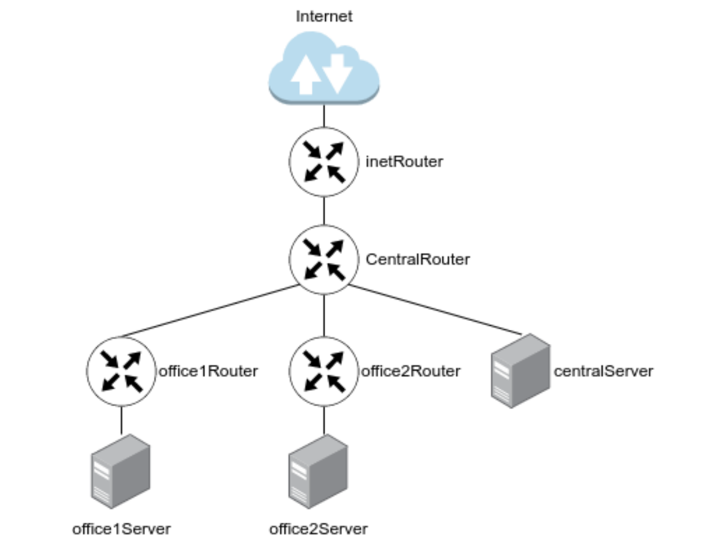

# HW18 - Разворачиваем сетевую лабораторию

## Введение

Сеть — очень важная составляющая в работе серверов. По сети сервера взаимодействуют между собой.
В данном домашнем задании мы рассмотрим технологии маршрутизации и NAT.

Маршрутизация — выбор оптимального пути передачи пакетов. Для маршрутизации используется таблица маршрутизации.

Основная задача маршрутизации — доставить пакет по указанному IP-адресу.

Если одно устройство имеет сразу несколько подсетей, например в сервере есть 2 порта с адресами:

- 192.168.1.10/24
- 10.10.12.72/24

то, такие сети называются непосредственно подключенными (Directly connected networks). Маршрутизация между Directrly  Connected сетями происходит автоматически. Дополнительная настройка не потребуется.

Если необходимая сеть удалена, маршрутизатор будет искать через какой порт она будет доступна, если такой порт не найден, то трафик уйдет на шлюз по умолчанию.

Маршрутизация бывает статическая и динамическая.

При использовании статической маршрутизации администратор сам создаёт правила для маршрутов. Плюсом данного метода будет являться безопасность, так как статические маршруты не обновляются по сети, а минусом — сложности при работе с сетями больших объёмов.

Динамическая маршрутизация подразумевает построение маршрутов автоматически с помощью различных протоколов (RIP,OSPF,BGP, и т.д.). Маршрутизаторы сами обмениваются друг с другом информацией о сетях и автоматически прописывают маршруты.
NAT — это процесс, используемый для преобразования сетевых адресов.

Основные цели NAT:

- Экономия публичных IPv4-адресов
- Повышение степени конфиденциальности и безопасности сети

NAT обычно работает на границе, где локальная сеть соединяется с сетью Интернет. Когда устройству сети потребуется подключение к устройству вне его сети (например в Интернете), пакет пересылается маршрутизатору с NAT, а маршрутизатор преобразовывает его внутренний адрес в публичный.

## Цели домашнего задания

Создать домашнюю сетевую лабораторию. Научится менять базовые сетевые настройки в Linux-based системах.

## Описание домашнего задания

1. Скачать и развернуть [Vagrant-стенд](https://github.com/erlong15/otus-linux/tree/network)

2. Построить следующую сетевую архитектуру:

Сеть office1

- 192.168.2.0/26 - dev
- 192.168.2.64/26 - test servers
- 192.168.2.128/26 - managers
- 192.168.2.192/26 - office hardware

Сеть office2

- 192.168.1.0/25 - dev
- 192.168.1.128/26 - test servers
- 192.168.1.192/26 - office hardware

Сеть central

- 192.168.0.0/28 - directors
- 192.168.0.32/28 - office hardware
- 192.168.0.64/26 - wif



Итого должны получиться следующие сервера:

- inetRouter
- centralRouter
- office1Router
- office2Router
- centralServer
- office1Server
- office2Server

Задание состоит из 2-х частей: теоретической и практической.

В теоретической части требуется:

- Найти свободные подсети
- Посчитать количество узлов в каждой подсети, включая свободные
- Указать Broadcast-адрес для каждой подсети
- Проверить, нет ли ошибок при разбиении

В практической части требуется:

- Соединить офисы в сеть согласно логической схеме и настроить роутинг
- Интернет-трафик со всех серверов должен ходить через inetRouter
- Все сервера должны видеть друг друга (должен проходить ping)
- У всех новых серверов отключить дефолт на NAT (eth0), который vagrant поднимает для связи
- Добавить дополнительные сетевые интерфейсы, если потребуется

Рекомендуется использовать Vagrant + Ansible для настройки данной схемы.

## Пошаговая инструкция выполнения домашнего задания

Все дальнейшие действия были проверены при использовании Vagrant 2.2.19, VirtualBox v6.1.26 r145957. Серьёзные отступления от этой конфигурации могут потребовать адаптации с вашей стороны.

### Теоретическая часть

В теоретической части нам необходимо продумать топологию сети, а также:

- Найти свободные подсети
- Посчитать количество узлов в каждой подсети, включая свободные
- Указать Broadcast-адрес для каждой подсети
- Проверить, нет ли ошибок при разбиении

Первым шагом мы рассмотрим все сети, указанные в задании.

Посчитаем для них количество узлов, найдём Broadcast-адрес, проверим, нет ли ошибок при разбиении.

Расчеты можно выполнить вручную, или воспользоваться калькулятором сетей. Для примера, посчитаем одну подсеть вручную:

У нас есть сеть directors 192.168.0.0/28

192.168.0.0 — это сама сеть, 28 — это маска. Маска показывает нам, границы сети 192.168.0.0. Маска может быть записана в 2-х видах:

1) /28  
2) 255.255.255.240

Пример перевода маски /28 в формат 255.255.255.240:

Маска Ipv4-адреса — это 4 октета, т.е. 4 блока по 8 цифр (1 или 0).  

/28 — это 28 единиц с начала маски: **11111111.11111111.11111111.11110000**

Всегда при разбиении сетей, после знака / указывается количество единиц с начала маски.

**11111111.11111111.11111111.11110000** — это двоичный код маски, если мы переведем данное значение в деситеричную систему счисления, то получим 255.255.255.240

Далее посчитаем количество устройств в сети: Количество устройств в сети рассчитывается по формуле = 2^(32−маска) − 2

Таким образом, количество устройств для подсети /28 будет = 2^(32−28) − 2 = 16 − 2 = 14

Цифра 2 вычитается, так как:

- Первый адрес (192.168.0.0) — это наименование подсети, его нельзя задать устройству
- Последний адрес (192.168.0.15) — это всегда broadcast-адрес.

Broadcast-адрес нужен для рассылки всем устройствам сети.

Таким образом мы можем сформировать таблицу топологии нашей сети

| Сеть | Маска | Кол-во адресов | Первый адрес в сети | Последний адрес в сети | Broadcast адрес |
| --- | --- | --- | --- | --- | --- |
| 192.168.0.0/28 | 255.255.255.240 | 14 | 192.168.0.1 | 192.168.0.14 | 192.168.0.15 |

По такому примеру нужно рассчитать остальные сети. Для проверки себя можно использовать калькулятор масок, например этот - <https://ip-calculator.ru/>

Для того, чтобы получить всю информацию по сети, потребуется указать ip-адрес и маску, например:


После расчета всех сетей, мы должны получить следующую таблицу топологии

| Name | Network | Netmask | N | Hostmin | Hostmax | Broadcast |
| ---  | --- | --- | --- | --- | --- | --- |
| Central Network |
| Directors | 192.168.0.0/28 | 255.255.255.240 | 14 | 192.168.0.1 | 192.168.0.14 | 192.168.0.15 |
| Office hardware | 192.168.0.32/28 | 255.255.255.240 | 14 | 192.168.0.33 | 192.168.0.46 | 192.168.0.47 |
| Wifi (mgt network) | 192.168.0.64/26 | 255.255.255.192 | 62 | 192.168.0.65 | 192.168.0.126 | 192.168.0.127 |
| Office 1 network |
| Dev | 192.168.2.0/26 | 255.255.255.192 | 62 | 192.168.2.1 | 192.168.2.62 | 192.168.2.63 |
| Test | 192.168.2.64/26 | 255.255.255.192 | 62 | 192.168.2.65 | 192.168.2.126 | 192.168.2.127 |
| Managers | 192.168.2.128/26 | 255.255.255.192 | 62 | 192.168.2.129 | 192.168.2.190 | 192.168.2.191 |
| Office hardware | 192.168.2.192/26 | 255.255.255.192 | 62 | 192.168.2.193 | 192.168.2.254 | 192.168.2.255 |
| Office 2 network |
| Dev | 192.168.1.0/25 | 255.255.255.128 | 126 | 192.168.1.1 | 192.168.1.126 | 192.168.1.127 |
| Test | 192.168.1.128/26 | 255.255.255.192 | 62 | 192.168.1.129 | 192.168.1.190 | 192.168.1.191 |
| Ofiice | 192.168.1.192/26 | 255.255.255.192 | 62 | 192.168.1.193 | 192.168.1.254 | 192.168.1.255 |
| InetRouter - CentralRouter network |
| Inet - central | 192.168.255.0/30 | 255.255.255.252 | 2 | 192.168.255.1 | 192.168.255.2 | 192.168.255.3 |

После создания таблицы топологии, мы можем заметить, что ошибок в задании нет, также мы сразу видим следующие свободные сети:

192.168.0.16/28  
192.168.0.48/28  
192.168.0.128/25  
192.168.255.64/26  
192.168.255.32/27  
192.168.255.16/28  
192.168.255.8/29  
192.168.255.4/30  

На этом теоретическая часть заканчивается. Можем приступать к выполнению практической части.

### Практическая часть

Изучив таблицу топологии сети и Vagrant-стенд из задания, мы можем построить полную схему сети:


Давайте рассмотрим схему:

Знак облака означает сеть, которую необходимо будет настроить на сервере

Значки роутеров и серверов означают хосты, которые нам нужно будет создать.

На схеме, мы сразу можем увидеть, что нам потребуется создать дополнительно 2 сети (на схеме обозначены полужирными фиолетовыми линиями):

Для соединения office1Router c centralRouter — 192.168.255.8/30  
Для соединения office2Router c centralRouter — 192.168.255.4/30

На основании этой схемы мы получаем готовый список серверов. Для более подробного изучения, сделаем новые хосты с другими ОС.

| Server | IP and Bitmask | OS |
| --- | --- | --- |
| inetRouter | Default-NAT address VirtualBox 192.168.255.1/30 | CentOS 7 |
| centralRouter | 192.168.255.2/30 |CentOS 7 |
|| 192.168.0.1/28 ||
|| 192.168.0.33/28 ||
|| 192.168.0.65/26 ||
|| 192.168.255.9/30 ||
|| 192.168.255.5/30 ||
| centralServer | 192.168.0.2/28 | CentOS 7 |
| office1Router | 192.168.255.10/30 | Ubuntu 20 |
|| 192.168.2.1/26 ||
|| 192.168.2.65/26 ||
|| 192.168.2.129/26 ||
|| 192.168.2.193/26 ||
| office1Server | 192.168.2.130/26 | Ubuntu 20 |
| office2Router | 192.168.255.6/30 | Debian 11 |
|| 192.168.1.1/25 ||
|| 192.168.1.129/26 ||
|| 192.168.1.193/26 ||
| office2Server | 192.168.1.2/25 | Debian 11 |

Рекомендация:

При выполнении дальнейших действий, постоянно пользуйтесь схемой, она поможет быстрее понять некоторые моменты руководства.

Скачаем Vagrantfile из [репозитория](https://github.com/erlong15/otus-linux/tree/network)

После запуска стенда (Vagrant up), мы можем получить ошибку, что CentOS6 отсутствует в Vagrant Cloud. Это не проблема, мы можем просто заменить в inetRouter версию CentOS/6 на CentOS/7, после изменений мы получим следующий файл:

```ruby
# -*- mode: ruby -*-
# vim: set ft=ruby :
MACHINES = {
    :inetRouter => {
        :box_name => "centos/7",
        #:public => {:ip => '10.10.10.1', :adapter => 1},
        :net => [
            {ip: '192.168.255.1', adapter: 2, netmask: "255.255.255.252", virtualbox__intnet: "router-net"},
        ]
    },
    :centralRouter => {
        :box_name => "centos/7",
        :net => [
            {ip: '192.168.255.2', adapter: 2, netmask: "255.255.255.252", virtualbox__intnet: "router-net"},
            {ip: '192.168.0.1', adapter: 3, netmask: "255.255.255.240", virtualbox__intnet: "dir-net"},
            {ip: '192.168.0.33', adapter: 4, netmask: "255.255.255.240", virtualbox__intnet: "hw-net"},
            {ip: '192.168.0.65', adapter: 5, netmask: "255.255.255.192", virtualbox__intnet: "mgt-net"},
        ]
    },
    :centralServer => {
        :box_name => "centos/7",
        :net => [
            {ip: '192.168.0.2', adapter: 2, netmask: "255.255.255.240", virtualbox__intnet: "dir-net"},
            {adapter: 3, auto_config: false, virtualbox__intnet: true},
            {adapter: 4, auto_config: false, virtualbox__intnet: true},
        ]
    },
}

Vagrant.configure("2") do |config|
    MACHINES.each do |boxname, boxconfig|
        config.vm.define boxname do |box|
            
            box.vm.box = boxconfig[:box_name]
            box.vm.host_name = boxname.to_s
            boxconfig[:net].each do |ipconf|
                box.vm.network "private_network", ipconf
            end

            if boxconfig.key?(:public)
                box.vm.network "public_network", boxconfig[:public]
            end

            box.vm.provision "shell", inline: <<-SHELL
                mkdir -p ~root/.ssh
                cp ~vagrant/.ssh/auth* ~root/.ssh
            SHELL

            case boxname.to_s
            when "inetRouter"
                box.vm.provision "shell", run: "always", inline: <<-SHELL
                    sysctl net.ipv4.conf.all.forwarding=1
                    iptables -t nat -A POSTROUTING ! -d 192.168.0.0/16 -o eth0 -j MASQUERADE
                SHELL
            when "centralRouter"
                box.vm.provision "shell", run: "always", inline: <<-SHELL
                    sysctl net.ipv4.conf.all.forwarding=1
                    echo "DEFROUTE=no" >> /etc/sysconfig/network-scripts/ifcfg-eth0
                    echo "GATEWAY=192.168.255.1" >> /etc/sysconfig/network-scripts/ifcfg-eth1
                    systemctl restart network
                SHELL
            when "centralServer"
                box.vm.provision "shell", run: "always", inline: <<-SHELL
                    echo "DEFROUTE=no" >> /etc/sysconfig/network-scripts/ifcfg-eth0
                    echo "GATEWAY=192.168.0.1" >> /etc/sysconfig/network-scripts/ifcfg-eth1
                    systemctl restart network
                SHELL
            end
        end
    end
end
```

Данный Vagrantfile развернет нам 3 хоста: inetRouter, centralRouter и centralServer.

Исходя их схемы нам ещё потребуется развернуть 4 сервера:

- office1Router
- office1Server
- office2Router
- office2Server

Опираясь на таблицу и схему мы можем дописать хосты в Vagrantfile:

```ruby
MACHINES = {
    :inetRouter => {
        :box_name => "centos/7",
        :vm_name => "inetRouter",
        #:public => {:ip => '10.10.10.1', :adapter => 1},
        :net => [
            {ip: '192.168.255.1', adapter: 2, netmask: "255.255.255.252", virtualbox__intnet: "router-net"},
            {ip: '192.168.50.10', adapter: 8},
        ]
    },
    :centralRouter => {
        :box_name => "centos/7",
        :vm_name => "centralRouter",
        :net => [
            {ip: '192.168.255.2', adapter: 2, netmask: "255.255.255.252", virtualbox__intnet: "router-net"},
            {ip: '192.168.0.1', adapter: 3, netmask: "255.255.255.240", virtualbox__intnet: "dir-net"},
            {ip: '192.168.0.33', adapter: 4, netmask: "255.255.255.240", virtualbox__intnet: "hw-net"},
            {ip: '192.168.0.65', adapter: 5, netmask: "255.255.255.192", virtualbox__intnet: "mgt-net"},
            {ip: '192.168.255.9', adapter: 6, netmask: "255.255.255.252", virtualbox__intnet: "office1-central"},
            {ip: '192.168.255.5', adapter: 7, netmask: "255.255.255.252", virtualbox__intnet: "office2-central"},
            {ip: '192.168.50.11', adapter: 8},            
        ]
    },
    :centralServer => {
        :box_name => "centos/7",
        :vm_name => "centralServer",
        :net => [
            {ip: '192.168.0.2', adapter: 2, netmask: "255.255.255.240", virtualbox__intnet: "dir-net"},
            {adapter: 3, auto_config: false, virtualbox__intnet: true},
            {adapter: 4, auto_config: false, virtualbox__intnet: true},
            {ip: '192.168.50.12', adapter: 8},
        ]
    },
    :office1Router => {
        :box_name => "ubuntu/focal64",
        :vm_name => "office1Router",
        :net => [
            {ip: '192.168.255.10', adapter: 2, netmask: "255.255.255.252", virtualbox__intnet: "office1-central"},
            {ip: '192.168.2.1', adapter: 3, netmask: "255.255.255.192", virtualbox__intnet: "dev1-net"},
            {ip: '192.168.2.65', adapter: 4, netmask: "255.255.255.192", virtualbox__intnet: "test1-net"},
            {ip: '192.168.2.129', adapter: 5, netmask: "255.255.255.192", virtualbox__intnet: "managers-net"},
            {ip: '192.168.2.193', adapter: 6, netmask: "255.255.255.192", virtualbox__intnet: "office1-net"},
            {ip: '192.168.50.20', adapter: 8},
        ]
    },
    :office1Server => {
        :box_name => "ubuntu/focal64",
        :vm_name => "office1Server",
        :net => [
            {ip: '192.168.2.130', adapter: 2, netmask: "255.255.255.192", virtualbox__intnet: "managers-net"},
            {ip: '192.168.50.21', adapter: 8},
        ]
    },
    :office2Router => {
        :box_name => "debian/bullseye64",
        :vm_name => "office2Router",
        :net => [
            {ip: '192.168.255.6', adapter: 2, netmask: "255.255.255.252", virtualbox__intnet: "office2-central"},
            {ip: '192.168.1.1', adapter: 3, netmask: "255.255.255.128", virtualbox__intnet: "dev2-net"},
            {ip: '192.168.1.129', adapter: 4, netmask: "255.255.255.192", virtualbox__intnet: "test2-net"},
            {ip: '192.168.1.193', adapter: 5, netmask: "255.255.255.192", virtualbox__intnet: "office2-net"},
            {ip: '192.168.50.30', adapter: 8},
        ]
    },
    :office2Server => {
        :box_name => "debian/bullseye64",
        :vm_name => "office2Server",
        :net => [
            {ip: '192.168.1.2', adapter: 2, netmask: "255.255.255.128", virtualbox__intnet: "dev2-net"},
            {ip: '192.168.50.31', adapter: 8},
        ]
    }    
}
```

В данный Vagrantfile мы добавили информацию о 4 новых серверах, также к старым серверам добавили 2 интерфейса для соединения сетей офисов (в коде выделены полужирным)

Дополнительно в коде вы видите сетевые устройства из подсети 192.168.50.0/24 — они не обязательны и потребуются, если вы планируете настраивать хосты с помощью Ansible.

После того, как все 7 серверов у нас развернуты, нам нужно настроить маршрутизацию и NAT таким образом, чтобы доступ в Интернет со всех хостов был через inetRouter и каждый сервер должен быть доступен с любого из 7 хостов.

Часть настройки у нас уже выполнена, давайте рассмотрим подробнее команды из Vagrantfile.

#### Настройка NAT

Для того, чтобы на всех серверах работал интернет, на сервере inetRouter должен быть настроен NAT. В нашем Vagrantfile он настраивается с помощью команды:

```bash
iptables -t nat -A POSTROUTING ! -d 192.168.0.0/16 -o eth0 -j MASQUERADE
```

При настройке NAT таким образом, правило удаляется после перезагрузки сервера. Для того, чтобы правила применялись после перезагрузки, в CentOS 7 нужно выполнить следующие действия:

- Подключиться по SSH к хосту: vagrant ssh inetRouter
- Проверить, что отключен другой файервол: systemctl status firewalld

```bash
systemctl status firewalld

● firewalld.service - firewalld - dynamic firewall daemon
   Loaded: loaded (/usr/lib/systemd/system/firewalld.service; disabled; vendor preset: enabled)
   Active: inactive (dead)
     Docs: man:firewalld(1)
```

Если служба будет запущена, то нужно её отключить и удалить из автозагрузки:

```bash
systemctl stop firewalld
systemctl disable firewalld
```

- Установить пакеты iptables и iptables-services:

```bash
yum -y install iptables iptables-services
```

- Добавить службу iptables в автозапуск: systemctl enable iptables
- Отредактировать файл /etc/sysconfig/iptables: vi /etc/sysconfig/iptables

```bash
# sample configuration for iptables service
# you can edit this manually or use system-config-firewall
# please do not ask us to add additional ports/services to this default configuration
*filter
:INPUT ACCEPT [0:0]
:FORWARD ACCEPT [0:0]
:OUTPUT ACCEPT [0:0]
-A INPUT -m state --state RELATED,ESTABLISHED -j ACCEPT
-A INPUT -p icmp -j ACCEPT
-A INPUT -i lo -j ACCEPT
-A INPUT -p tcp -m state --state NEW -m tcp --dport 22 -j ACCEPT
# Deny ping trafic
# -A INPUT -j REJECT --reject-with icmp-host-prohibited
# -A FORWARD -j REJECT --reject-with icmp-host-prohibited
COMMIT
# Generated by iptables-save v1.4.21 on Mon Jul 25 21:05:06 2022
*nat
:PREROUTING ACCEPT [27:2024]
:INPUT ACCEPT [3:200]
:OUTPUT ACCEPT [80:5258]
:POSTROUTING ACCEPT [0:0]
-A POSTROUTING ! -d 192.168.0.0/16 -o eth0 -j MASQUERADE
COMMIT
# Completed on Mon Jul 25 21:05:06 2022
```

Данный файл содержит в себе базовые правила, которые появляются с установкой iptables.

Обратите, пожалуйста, внимание на следующие правила:

```bash
-A INPUT -j REJECT --reject-with icmp-host-prohibited
-A FORWARD -j REJECT --reject-with icmp-host-prohibited
```

Они запретят ping между хостами, через данный сервер. В данном ДЗ эти команды нужно удалить или закомментировать, чтобы они не применялись.

Файл /etc/sysconfig/iptables не обязательно писать с нуля. Можно поступить следующим образом:

- Установить iptables и iptables-services
- Запустить службу iptables
- Внести необходимые правила iptables (и удалить ненужные)
- Выполнить команду iptables-save > /etc/sysconfig/iptables

> Данная команда сохранит в файл измененные правила. Для их применения нужно перезапустить службу iptables.

Если просто запустить команду iptables-save, то на экране консоли появится полный список всех правил, которые действуют на текущий момент. Данная команда очень удобна для поиска проблем в iptables

#### Настройка NAT через Ansible

Выполним идентичные действия с помощью Ansible, для этого в playbook добавим следующие команды:

```bash
---
- hosts: all
  become: true
  tasks:
  - name: Set up NAT on inetRouter
    block:
      - name: install iptables
        yum:
          name:
            - iptables
            - iptables-services
          state: present
          update_cache: true

      - name: copy iptables config
        template:
          src: iptables
          dest: /etc/sysconfig/iptables
          owner: root
          group: root
          mode: 0600

      - name: start and enable iptables service
        service:
          name: iptables
          state: restarted
          enabled: true
    when: (ansible_hostname == "inetRouter")
```

Все действия выполняются в блоке, это нужно для того, чтобы в конце указать условие «Выполнять только на хосте inetRouter»

Первый модуль «install iptables» устанавливает нам необходимые пакеты. Второй модуль копирует нам конфигурационный файл правил Iptables (который мы рассматривали в настройке NAT вручную). Третий модуль производит старт службы iptables и её добавление в автозапуск.

#### Маршрутизация транзитных пакетов (IP forward)

Важным этапом настройки сетевой лаборатории, является маршрутизация транзитных пакетов. Если объяснить простыми словами — это возможность сервера Linux пропускать трафик через себя к другому серверу. По умолчанию эта функция отключена в Linux.

Включить её можно командой:

```bash
sysctl net.ipv4.conf.all.forwarding=1
```

Посмотреть статус форвардинга можно командой:

```bash
sysctl net.ipv4.ip_forward
```

Если параметр равен 1, то маршрутизация транзитных пакетов включена, если 0 — отключена.

> В нашей схеме необходимо включить данную маршрутизацию на всех роутерах.

#### Настройка маршрутизации транзитных пакетов с помощью Ansible

В Ansible есть специальный блок для внесений изменений в параметры ядра:

```bash
- name: set up forward packages across routers
  sysctl:
    name: net.ipv4.conf.all.forwarding
    value: '1'
    state: present
  when: "'routers' in group_names"
```

В условии указано, что изменения будут применяться только для группы «routers», группа routers создана в hosts-файле:

```bash
[routers]
inetRouter ansible_host=192.168.50.10 ansible_user=vagrant ansible_ssh_private_key_file=.vagrant/machines/inetRouter/virtualbox/private_key
centralRouter ansible_host=192.168.50.11 ansible_user=vagrant ansible_ssh_private_key_file=.vagrant/machines/centralRouter/virtualbox/private_key
office1Router ansible_host=192.168.50.20 ansible_user=vagrant ansible_ssh_private_key_file=.vagrant/machines/office1Router/virtualbox/private_key
office2Router ansible_host=192.168.50.30 ansible_user=vagrant ansible_ssh_private_key_file=.vagrant/machines/office2Router/virtualbox/private_key
[servers]
office1Server ansible_host=192.168.50.21 ansible_user=vagrant ansible_ssh_private_key_file=.vagrant/machines/office1Server/virtualbox/private_key
office2Server ansible_host=192.168.50.31 ansible_user=vagrant ansible_ssh_private_key_file=.vagrant/machines/office2Server/virtualbox/private_key
centralServer ansible_host=192.168.50.12 ansible_user=vagrant ansible_ssh_private_key_file=.vagrant/machines/centralServer/virtualbox/private_key
```

> Файл hosts — это файл инвентаризации, в нем указан список серверов, их адреса, группы и способы доступа на сервер.

#### Отключение маршрута по умолчанию на интерфейсе eth0

При разворачивании нашего стенда Vagrant создает в каждом сервере свой интерфейс, через который у сервера появляется доступ в интернет. Отключить данный порт нельзя, так как через него Vagrant подключается к серверам. Обычно маршрут по умолчанию прописан как раз на этот интерфейс, данный маршрут нужно отключить.

Для отключения дефолтного маршрута нужно в файле /etc/sysconfig/network-scripts/ifcfg-eth0 найти строку

```bash
DEFROUTE=yes и поменять её на DEFROUTE=no
```

Vagrant по умолчанию не добавляет строку DEFROUTE=yes, поэтому нам можно просто добавить строку DEFROUTE=no

Добавление строки:

```bash
echo "DEFROUTE=no" >> /etc/sysconfig/network-scripts/ifcfg-eth0
```

Данное действие нужно выполнить только на CentOS-серверах centralRouter и centralServer

После удаление маршрута по умолчанию, нужно добавить дефолтный маршрут на другой порт. Делается это с помощью идентичной команды, например, команда добавления маршрута по умолчанию на сервере centralServer будет такой:

```bash
echo "GATEWAY=192.168.0.1" >> /etc/sysconfig/network-scripts/ifcfg-eth1
```

После внесения данных изменений нужно перезапустить сетевую службу: sytemctl restart network

#### Изменений маршрута по умолчанию с помощью Ansible

Для выполнения идентичных изменений с помощью Ansible, можно воспользоваться следующим блоком:

```bash
# echo "DEFROUTE=no" >> /etc/sysconfig/network-scripts/ifcfg-eth0
- name: deisable default route
  lineinfile:
    dest: /etc/sysconfig/network-scripts/ifcfg-eth0
    line: DEFROUTE=no
  when: (ansible_hostname == "centralRouter") or (ansible_hostname == "centralServer")

# echo "GATEWAY=192.168.255.1" >> /etc/sysconfig/network-scripts/ifcfg-eth1
- name: add default gateway for centralRouter
  lineinfile:
    dest: /etc/sysconfig/network-scripts/ifcfg-eth1
    line: GATEWAY=192.168.255.1
  when: (ansible_hostname == "centralRouter")

# echo "GATEWAY=192.168.0.1" >> /etc/sysconfig/network-scripts/ifcfg-eth1
- name: add default gateway for centralServer
  lineinfile:
    dest: /etc/sysconfig/network-scripts/ifcfg-eth1
    line: GATEWAY=192.168.0.1
  when: (ansible_hostname == "centralServer")
```

> Модуль lineinfile добавляет строку в файл. Если строка уже добавлена, то второй раз она не добавится.

На этом этапе, команды, указанные в Vagrant-файле закончились. Далее нам нужно настроить статическую маршрутизацию на всех серверах.

#### Настройка статических маршрутов

Для настройки статических маршрутов используется команда ip route. Данная команда работает в Debian-based и RHEL-based системах.

Давайте рассмотрим пример настройки статического маршрута на сервере office1Server. Исходя из схемы мы видим, что трафик с данного сервера будет идти через office1Router. Office1Server и office1Router у нас соединены через сеть managers (192.168.2.128/26). В статическом маршруте нужно указывать адрес следующего хоста. Таким образом мы должны указать на сервере office1Server маршрут, в котором доступ к любым IP-адресам у нас будет происходить через адрес 192.168.2.129, который расположен на сетевом интерфейсе office1Router. Команда будет выглядеть так: ip route add 0.0.0.0/0 via 192.168.2.129

Посмотреть список всех маршрутов: ip route

```bash
ip r
default via 192.168.2.129 dev enp0s8 
default via 10.0.2.2 dev enp0s3 proto dhcp src 10.0.2.15 metric 100 
10.0.2.0/24 dev enp0s3 proto kernel scope link src 10.0.2.15 
10.0.2.2 dev enp0s3 proto dhcp scope link src 10.0.2.15 metric 100 
192.168.2.128/26 dev enp0s8 proto kernel scope link src 192.168.2.130 
192.168.50.0/24 dev enp0s19 proto kernel scope link src 192.168.50.21 
```

Удалить маршрут: ip route del 0.0.0.0/0 via 192.168.2.129

> Важно помнить, что маршруты, настроенные через команду ip route удаляются после перезагрузки или перезапуске сетевой службы.

Для того, чтобы маршруты сохранялись после перезагрузки нужно их указывать непосредственно в файле конфигурации сетевого интерфейса:

- В CentOS нужно создать файл route-<имя интерфейса>, например для интерфейса /etc/sysconfig/network-scripts/ifcfg-eth1 необходимо создать файл /etc/sysconfig/network-scripts/route-eth1 и указать там правила в формате: <Сеть назначения>/<маска> via \<Next hop address>

Пример файла /etc/sysconfig/network-scripts/route-eth1

```bash
192.168.0.0/22 via 192.168.255.2
192.168.255.4/30 via 192.168.255.2
192.168.255.8/30 via 192.168.255.2
```

Применение маршрутов: service network restart

- В современных версиях Ubuntu, для указания маршрута нужно поправить netplan-конфиг. Конфиги netplan хранятся в виде YAML-файлов и обычно лежат в каталоге /etc netplan В нашем стенде такой файл - /etc/netplan/50-vagrant.yaml

Для добавления маршрута, после раздела addresses нужно добавить блок:

```bash
    enp0s8:
      addresses:
      - 192.168.2.130/26
     routes:
     - to: <сеть назначения>/<маска>
       via: <Next hop address>
```

Пример файла /etc/netplan/50-vagrant.yaml

```yml
---
network:
  version: 2
  renderer: networkd
  ethernets:
    enp0s8:
      addresses:
      - 192.168.2.130/26
      routes:
      - to: 0.0.0.0/0
        via: 192.168.2.129
    enp0s19:
      addresses:
      - 192.168.50.21/24
```

> В YAML-файле очень важно следить за правильными отступами, ошибка в один пробел не даст сохранить изменения.

Применение изменений:

```bash
root@office1Server:~# netplan apply
root@office1Server:~# netplan try
Warning: Stopping systemd-networkd.service, but it can still be activated by: systemd-networkd.socket
Do you want to keep these settings?
Press ENTER before the timeout to accept the new configuration
Changes will revert in 118 seconds
Configuration accepted.
root@office1Server:~#
```

В Debian маршрут указывается в файле с сетевыми интерфейсами /etc/network/interfaces. Маршрут указывается после описания самого интерфейса и напоминает команду ip route: up ip route add <сеть назначения>/<маска> via \<next hop address>

Также требуется удалить маршрут по умолчанию: post-up ip route del default dev eth0

Пример файла /etc/network/interfaces

```bash
# interfaces(5) file used by ifup(8) and ifdown(8)
# Generate from Ansible
# Include files from /etc/network/interfaces.d:
source-directory /etc/network/interfaces.d

# The loopback network interface
auto lo
iface lo inet loopback

# The primary network interface
allow-hotplug eth0
iface eth0 inet dhcp

# delete vagrant default route
post-up ip route del default dev eth0

# The contents below are automatically generated by Ansible. Do not modify.
auto eth1
iface eth1 inet static
    address 192.168.1.2
    netmask 255.255.255.128

# default route
up ip route add 0.0.0.0/0 via 192.168.1.1

# The contents below are automatically generated by Ansible. Do not modify.
auto eth2
iface eth2 inet static
    address 192.168.50.31
    netmask 255.255.255.0
```

Для применения изменений нужно перезапустить сетевую службу: systemctl restart networking

При настройке интерфейсов и маршрутов в любой из ОС можно оставлять комментарии в файле. Перед комментарием должен стоять знак «#»

Настроим самостоятельно остальные маршруты на серверах. Важно помнить, что помимо маршрутов по умолчанию, вам нужно будет использовать обратные маршруты.

Давайте разберем пример такого маршрута: допустим мы хотим отправить команду ping с сервера office1Server (192.168.2.130) до сервера centralRouter (192.168.0.1)

Наш трафик пойдёт следующим образом: office1Server — office1Router — centralRouter — office1Router — office1Server Office1Router знает сеть (192.168.2.128/26), в которой располагается сервер office1Server, а сервер centralRouter, когда получит запрос от адреса 192.168.2.130 не будет понимать, куда отправить ответ.

Решением этой проблемы будет добавление обратного маршрута.

Обратный маршрут указывается также как остальные маршруты. Изучив схему мы видим, что связь между сетеми 192.168.2.0/24 и 192.168.0.0/24 осуществляется через сеть 192.168.255.8/30. Также мы видим что сети office1 подключены к centralRouter через порт eth5. На основании этих данных мы можем создать файл /etc/sysconfig network-scripts/route-eth5 и добавить в него маршрут 192.168.2.0/24 via 192.168.255.10

#### Настройка маршрутов с помощью Ansible

Для настройки маршрутов с помощью Ansible, нам необходимо подготовить файлы с маршрутами для всех серверов. Далее с помощью модуля template мы можем их добавлять:

```bash
    - name: set up route on office1Server
      template:
        src: office1Server_route.j2
        dest: /etc/netplan/50-vagrant.yaml
        owner: root
        group: root
        mode: 0644
      when: (ansible_hostname == "office1Server")
    - name: set up route on office2Server
      template:
        src: office2Server_route.j2
        dest: /etc/network/interfaces
        owner: root
        group: root
        mode: 0644
      when: (ansible_hostname == "office2Server")
    - name: set up route on centralRouter eth1
      template:
        src: centralRouter_route_eth1.j2
        dest: /etc/sysconfig/network-scripts/route-eth1
        owner: root
        group: root
        mode: 0644
      when: (ansible_hostname == "centralRouter")
```

Пример конфигурационного файла office1Server_route.j2

```bash
---
network:
  version: 2
  renderer: networkd
  ethernets:
    enp0s8:
      addresses:
      - 192.168.2.130/26
      routes:
      - to: 0.0.0.0/0
        via: 192.168.2.129
    enp0s19:
      addresses:
      - 192.168.50.21/24
```

Также модуль template позволяет использовать jinja2-шаблоны, с помощью которых файл может генериться автоматически, забирая информацию из данных о хосте (Ansible facts) и файлов переменных.

Более подробно про jinja2-шаблоны можно прочитать тут - <https://docs.ansible.com/ansible/2.9/user_guide/playbooks_templating.html>

На данном этапе настройка серверов закончена. После настройки серверов рекомендуется перезагрузить все хосты, чтобы проверить, что правила не удаляются после перезагрузки.

Помимо этого, рекомендуется на все хосты установить утилиту traceroute, для проверки нашего стенда.

Установка traceroute:

- CentOS 7: yum —i install traceroute
- Debian,Ubuntu: apt install -y traceroute

Пример проверки выхода в Интернет через сервер inetRouter c хоста office1Server:

```bash
traceroute 8.8.8.8

traceroute to 8.8.8.8 (8.8.8.8), 64 hops max
  1   192.168.2.129  0.412ms  0.476ms  0.865ms 
  2   192.168.255.9  1.111ms  0.640ms  0.681ms 
  3   192.168.255.1  1.115ms  2.877ms  1.096ms 
  4   *  *  * 
  5   *  *  * 
  6   *  *  * 
  7   *  *  * 
  8   10.210.116.30  4.676ms  4.548ms  3.688ms 
  9   10.210.116.22  4.848ms  4.146ms  4.240ms 
 10   72.14.211.20  5.293ms  4.221ms  3.776ms 
 11   74.125.244.132  4.836ms  4.372ms  3.606ms 
 12   72.14.232.85  18.513ms  5.947ms  29.603ms 
 13   209.85.251.63  9.950ms  7.416ms  6.920ms 
 14   *  *  * 
 15   *  *  * 
 16   *  *  * 
 17   *  *  * 
 18   *  *  * 
 19   *  *  * 
 20   *  *  * 
 21   *  *  * 
 22   *  *  * 
 23   8.8.8.8  9.485ms  8.929ms  7.424ms 
```

В данном примере, в первых трёх переходах мы видим что запрос идёт через сервера: office1Router — centralRouter — inetRouter

Пример проверки доступности office1Server c хоста office2Server:

```bash
traceroute 192.168.2.130
traceroute to 192.168.2.130 (192.168.2.130), 30 hops max, 60 byte packets
 1  192.168.1.1 (192.168.1.1)  0.690 ms  0.659 ms  0.642 ms
 2  192.168.255.5 (192.168.255.5)  1.904 ms  1.858 ms  1.825 ms
 3  192.168.255.10 (192.168.255.10)  3.199 ms  3.186 ms  3.149 ms
 4  192.168.2.130 (192.168.2.130)  7.888 ms  8.344 ms  8.337 ms
```

Для того, чтобы Ansible запускался сразу после развертывания серверов командой vagrant up, в текущий Vagrantfile нужно добавить блок запуска Ansible. Данный блок рекомендуется добавить после блока разворачивания виртуальных машин:

```ruby
            if boxconfig[:vm_name] == "office2Server"
                box.vm.provision "ansible" do |ansible|
                    ansible.playbook = "ansible/provision.yml"
                    ansible.inventory_path = "ansible/hosts"
                    ansible.host_key_checking = "false"
                    ansible.limit = "all"
                end
            end
```

При добавлении блока Ansible в Vagrant, Ansible будет запускаться после создания каждой ВМ, это создат ошибку в разворачивании стенда и стенд не развернется. Для того, чтобы Ansible запустился после создания виртуальных машин, можно добавить условие, которое будет сравнивать имя виртуальной машины, и, когда условный оператор увидит имя последней созданной ВМ (office2Server), он запустит Ansible.

Разворачивание 7 виртуальных машин — процесс достаточно затраный для ресурсов компьютера. При разворачивании стенда с помощью Ansible иногда могут вылетать ошибки из-за сетевой связности. Это не страшно, после того как ВМ будут созданы, можно просто ещё раз запустить процесс настройки через ansible с помощью команды: vagrant provision.

## Рекомендуемые источники

- [Статья «Маршрутизация в linux»](https://losst.ru/marshrutizatsiya-v-linux)
- [Статья «NAT для новичков»](https://habr.com/ru/post/583172/)
- [Статья «Templating(Jinja2)»](https://docs.ansible.com/ansible/2.9/user_guide/playbooks_templating.html)
- [Статья «Ansible Provisioner»](https://www.vagrantup.com/docs/provisioning/ansible)
