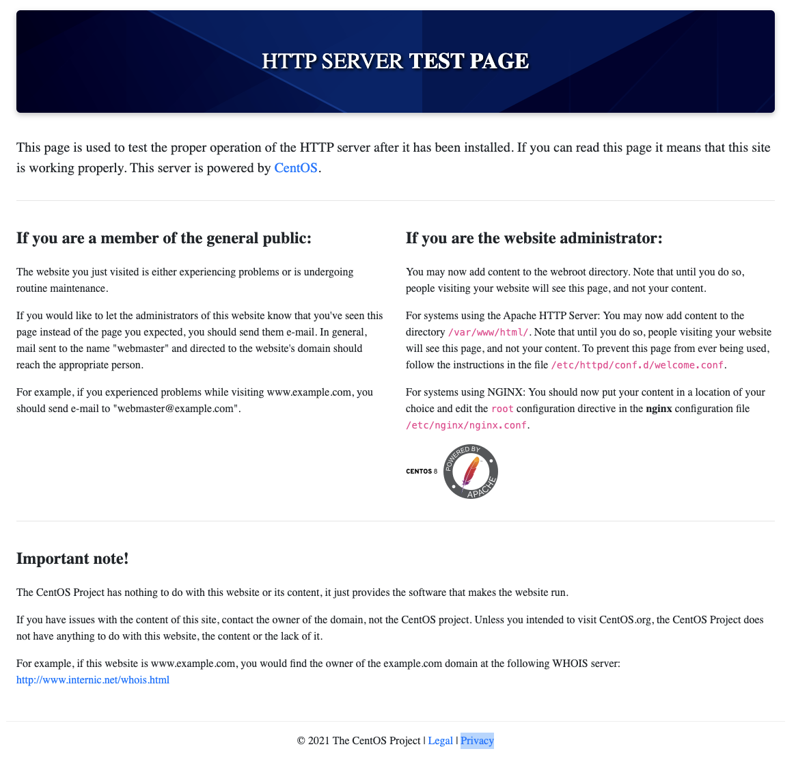
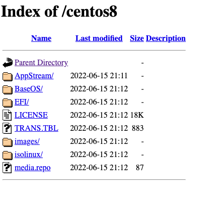
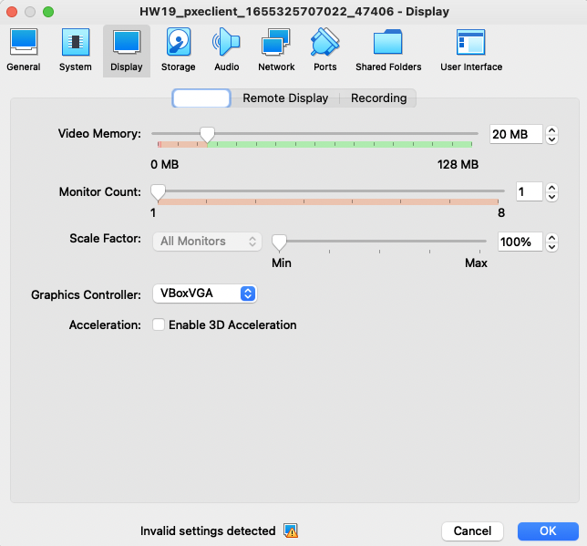
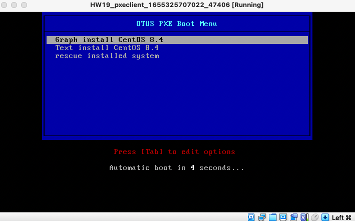
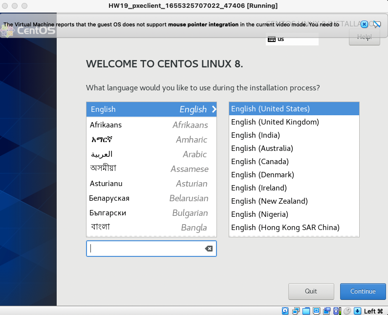
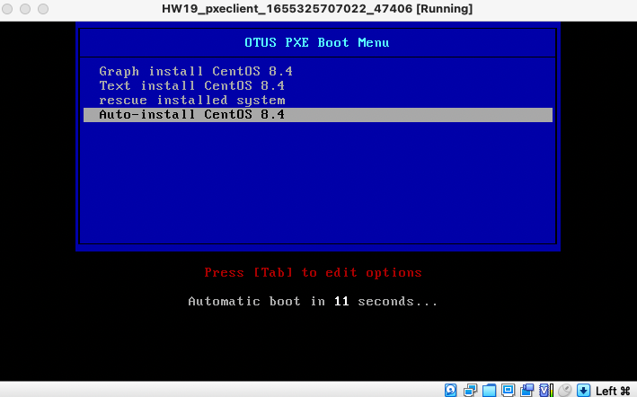
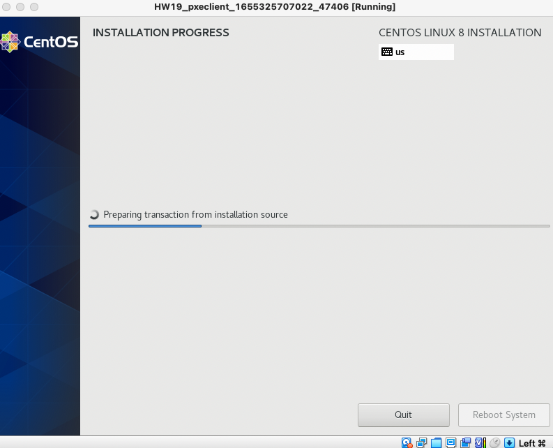

# HW19 - Настройка PXE сервера для автоматической установки

## Введение

Бывают ситуации, когда ИТ-специалисту потребуется переустанвить ОС на большом количестве хостов. Переустановка вручную потребует от специалиста большого количества времени. В этот момент стоит обратить внимание на PXE.

PXE (Preboot eXecution Environment) — это набор протоколов, которые позволяют загрузить хост из сети. Для загрузки будет использоваться сетевая карта хоста.

Для PXE требуется:

- Со стороны клиента (хоста на котором будем устанавливать или загружать ОС):
  - Cетевая карта, которая поддерживает стандарт PXE
- Со стороны сервера:
  - DHCP-сервер
  - TFTP-сервер

TFTP (Trivial File Transfer Protocol) — простой протокол передачи файлов, используется главным образом для первоначальной загрузки бездисковых рабочих станций. Основная задача протокола TFTP — отправка указанных файлов клиенту. TFTP работает на 69 UDP порту.

TFTP — очень простой протокол, у него нет аутентификации, возможности удаления файлов и т д. Протокол может только отправлять запросы на чтение и запись…

DHCP (Dynamic Host Configuration Protocol) — протокол динамической настройки узла, позволяет сетевым устройствам автоматически получать IP-адрес и другие параметры, необходимые для работы в сети TCP/IP. Протокол DHCP пришёл на смену протоколу BOOTP. DHCP сохраняет обратную совместимость с BOOTP. Основное отличие протоколов заключается в том, что протокол DHCP помимо IP-адреса может отправлять клиенту дополнительные опции (маску подсети, адреса DNS-серверов, имя домена, адрес TFTP-сервера). Протокол DHCP использует следуюшие порты:

- UDP 67 на сервере
- UDP 68 на клиенте

Также DHCP позволяет DHCP-клиенту отправить ответом опции для DHCP-сервера.

Через DHCP мы можем передать клиенту адрес PXE-сервера и имя файла, к которому мы будем обращаться.

## Цели домашнего задания

Отработать навыки установки и настройки DHCP, TFTP, PXE загрузчика и автоматической загрузки

## Описание домашнего задания

1. Следуя шагам из документа https://docs.centos.org/en-US/8-docs/advanced-install/assembly_preparing-fora-network-install установить и настроить загрузку по сети для дистрибутива CentOS 8.
В качестве шаблона воспользуйтесь репозиторием https://github.com/nixuser/virtlab/tree/main/centos_pxe
2. Поменять установку из репозитория NFS на установку из репозитория HTTP.
3. Настройить автоматическую установку для созданного kickstart файла (*) Файл загружается по HTTP.
4. автоматизировать процесс установки Cobbler cледуя шагам из документа https://cobbler.github.io/quickstart/.
Задание со звездочкой выполняется по желанию.

Функциоанльные и нефункциональные требования:

- ПК на Unix c 8ГБ ОЗУ или виртуальная машина с включенной Nested Virtualization.

Предварительно установленное и настроенное следующее ПО:

- Hashicorp Vagrant (https://www.vagrantup.com/downloads)
- Oracle VirtualBox (https://www.virtualbox.org/wiki/Linux_Downloads).
- Ansible (версия 2.8 и выше) - https://docs.ansible.com/ansible/latest/installation_guide/intro_installation.html
- Любой редактор кода, например Visual Studio Code, Atom и т.д.
- *(Не обязательно) Python версии 3 и выше - (https://python-scripts.com/install-python)

## Пошаговая инструкция выполнения домашнего задания

1. Работа с шаблоном из задания
Скачиваем файлы, указанные в домашнем задании. Рассмотрим загруженный Vagrantfile:

```ruby
# -*- mode: ruby -*-
# vi: set ft=ruby :
# export VAGRANT_EXPERIMENTAL="disks"

Vagrant.configure("2") do |config|

    config.vm.define "pxeserver" do |server|

        server.vm.box = 'centos/8.4'  
        server.vm.disk :disk, size: "15GB", name: "extra_storage1"

        server.vm.host_name = 'pxeserver'
        server.vm.network :private_network,
                            ip: "10.0.0.20",
                            virtualbox__intnet: 'pxenet'

        # server.vm.network "forwarded_port", guest: 80, host: 8081

        server.vm.provider "virtualbox" do |vb|
            vb.memory = "1024"
            vb.customize ["modifyvm", :id, "--natdnshostresolver1", "on"]
        end

        # ENABLE to setup PXE
        server.vm.provision "shell",
            name: "Setup PXE server",
            path: "setup_pxe.sh"
        end
    end

    # config used from this
    # https://github.com/eoli3n/vagrant-pxe/blob/master/client/Vagrantfile
    config.vm.define "pxeclient" do |pxeclient|
        pxeclient.vm.box = 'centos/8.4'
        pxeclient.vm.host_name = 'pxeclient'
        pxeclient.vm.network :private_network, ip: "10.0.0.21"
        pxeclient.vm.provider :virtualbox do |vb|

            vb.memory = "2048"
            vb.customize ["modifyvm", :id, "--natdnshostresolver1", "on"]
            vb.customize [
                'modifyvm', :id,
                '--nic1', 'intnet',
                '--intnet1', 'pxenet',
                '--nic2', 'nat',
                '--boot1', 'net',
                '--boot2', 'none',
                '--boot3', 'none',
                '--boot4', 'none'
            ]
        vb.customize ["modifyvm", :id, "--natdnshostresolver1", "on"]
        end
        # ENABLE to fix memory issues
        # end
    end

end
```

Жирным шрифтом отмечены строки, в которых требуется внести изменения. Давайте рассмотрим их более подробно:

- Pxeclient.vm.box = 'centos/8.4' и server.vm.box = 'centos/8.4' — на данный момент в Vagrant Box нет образа с таким именем. Нам требуется образ CentOS 8.4, мы можем воспользоваться образом bento/centos-8.4. Плюсом этого Vagrant Box является то, что по умолчанию он создаёт ОС с размером диска 60ГБ. При использовании данного образа нам не придётся полдключать дополнительный диск.
- \# export VAGRANT_EXPERIMENTAL="disks" и server.vm.disk :disk, size: "15GB", name: "extra_storage1" — так как нам хватает свободного места, мы можем не подключать дополнитеный диск. Если вы планируете в своём домашнем задании подключить дополнительный диск, то команда export VAGRANT_EXPERIMENTAL="disks" должна быть введена в терминале.
- \# server.vm.network "forwarded_port", guest: 80, host: 8081 — опция проброса порта. В нашем ДЗ её рекомендуется расскомментировать. Также для удобства можно поменять порт 8081 на любой удобный Вам.
- \# ENABLE to setup PXE — блок настройки PXE-сервера с помощью bash-скрипта. Так как мы будем использовать Ansible для настройки хоста, данный блок нам не понадобится. Его можно удалить. Далее можно будет добавить блок настройки хоста с помощью Ansible…
- Для настройки хоста через Ansible, нам потребуется добавить дополнтельный сетевой интефейс для Pxeserver. Пример добавления сетевого интефейса, с адресом 192.168.50.10: server vm.network :private_network, ip: "192.168.50.10", adapter: 3

После внесения всех изменений запускаем наш стенд с помощью команды vagrant up

```bash
    pxeclient: Adapter 1: nat
    pxeclient: Adapter 2: hostonly
==> pxeclient: Forwarding ports...
    pxeclient: 22 (guest) => 2200 (host) (adapter 1)
==> pxeclient: Running 'pre-boot' VM customizations...
==> pxeclient: Booting VM...
==> pxeclient: Waiting for machine to boot. This may take a few minutes...
    pxeclient: SSH address: 127.0.0.1:22
    pxeclient: SSH username: vagrant
    pxeclient: SSH auth method: private key
    pxeclient: Warning: Connection refused. Retrying...
    pxeclient: Warning: Connection refused. Retrying...
    pxeclient: Warning: Connection refused. Retrying...
    pxeclient: Warning: Connection refused. Retrying...
    pxeclient: Warning: Connection refused. Retrying...
```

> Выполнение команды закончится с ошибкой, так как на Pxeclient настроена загрузка по сети.
Теперь мы можем приступить к настройке Pxe-сервера.

Для настроки хоста с помощью Ansible нам нужно создать несколько файлов и положить их в отдельную папку (в моём примере имя папки ansible):

- Конфигурационный файл: ansible.cfg — файл описывает базовые настройки для работы Ansible:

```bash
[defaults]
#Отключение проверки ключа хоста
host_key_checking = false
#Указываем имя файла инвентаризации
inventory = hosts
#Отключаем игнорирование предупреждений
command_warnings= false
```

- Файл инвентаризации host — данный файл хранит информацию о том, как подключиться к хосту:
- [servers] - в квадратных скобках указана группа хостов
  - pxeserver — имя нашего хоста (имена хостов и групп не могут быть одинаковые)
  - ansible_host — адрес нашего хоста
  - ansible_user — имя пользователя, с помощью которого Ansible будет подключаться к хосту
  - ansible_ssh_private_key — адрес расположения ssh-ключа

```bash
[servers]
pxeserver ansible_host=192.168.50.10 ansible_user=vagrant
ansible_ssh_private_key_file=.vagrant/machines/inetRouter/virtualbox/private_key
```

- Ansible-playbook provision.yml — основной файл, в котором содержатся инструкции (модули) по настройке для Ansible.
- Дополнительно можно создать каталоги для темплейтов конфигурационных файлов (templates) и файлов с переменными (defaults)

### Настройка Web-сервера

Для того, чтобы отдавать файлы по HTTP нам потребуется настроенный веб-сервер.

Процесс настройки вручную:

- Так как у CentOS 8 закончилась поддержка, для установки пакетов нам потребуется поменять репозиторий. Сделать это можно с помощью сдедуюущих команд:

```bash
sed -i 's/mirrorlist/#mirrorlist/g' /etc/yum.repos.d/CentOS-Linux-*
sed -i 's|#baseurl=http://mirror.centos.org|baseurl=http://vault.centos.org|g' /etc/yum.repos.d/CentOS-Linux-*
```

- Устанавливаем Web-сервер Apache: yum install httpd
- Далее скачиваем образ CentOS 8.4.2150: wget --no-check-certificate https://mirror.sale-dedic.com/centos/8.4.2105/isos/x86_64/CentOS-8.4.2105-x86_64-dvd1.iso Размер образа больше 9ГБ, скачивание может занять продолжительное время.
- Монтируем данный образ: mount -t iso9660 CentOS-8.4.2105-x86_64-dvd1.iso /mnt -o loop,ro
- Создаём каталог /iso и копируем в него содержимое данного каталога:

```bash
mkdir /iso
cp -r /mnt/* /iso
```

- Ставим права 755 на каталог /iso: chmod -R 755 /iso
- Настраиваем доступ по HTTP для файлов из каталога /iso:
- Создаем конфигурационный файл: vi /etc/httpd/conf.d/pxeboot.conf
- Добавляем следующее содержимое в файл:

```bash
Alias /centos8 /iso
#Указываем адрес директории /iso
<Directory /iso>
    Options Indexes FollowSymLinks
    #Разрешаем подключения со всех ip-адресов
    Require all granted
</Directory>
```

- Перезапускаем веб-сервер: systemctl restart httpd
- Добавляем его в автозагрузку: systemctl enable httpd
- Проверяем, что веб-сервер работает и каталог /iso доступен по сети:
- С вашего компьютера сначала подключаемся к тестовой странице Apache:



Если страница открылась, значит веб-сервер запустился.

- Далее проверям доступность файлов по сети: 127.0.0.1:8081/centos8



Если файлы доступны, значит веб-сервер настроен корректно.

На этом настройка веб-сервера завершена.

### Настройка TFTP-сервера

TFTP-сервер потребуется для отправки первичных файлов загрузки (vmlinuz, initrd.img и т. д.)

- Устанавлием tftp-сервер: yum install tftp-server
- Запускаем службу: systemctl start tftp.service
- Проверяем, в каком каталоге будут храиться файлы, которые будет отдавать

TFTP-сервер: systemctl status tftp.service

В статусе видим, что рабочий каталог /var/lib/tftpboot

- Созаём каталог, в котором будем хранить наше меню загрузки: mkdir /var/lib/tftpboot/pxelinux.cfg
- Создаём меню-файл: vi /var/lib/tftpboot/pxelinux.cfg/default

```bash
default menu.c32
prompt 0
#Время счётчика с обратным отсчётом (установлено 15 секунд)
timeout 150
#Параметр использования локального времени
ONTIME local
#Имя «шапки» нашего меню
menu title OTUS PXE Boot Menu
        #Описание первой строки
        label 1
        #Имя, отображаемое в первой строке
        menu label ^ Graph install CentOS 8.4
        #Адрес ядра, расположенного на TFTP-сервере
        kernel /vmlinuz
        #Адрес файла initrd, расположенного на TFTP-сервере
        initrd /initrd.img
        #Получаем адрес по DHCP и указываем адрес веб-сервера
        append ip=enp0s3:dhcp inst.repo=http://10.0.0.20/centos8
        label 2
        menu label ^ Text install CentOS 8.4
        kernel /vmlinuz
        initrd /initrd.img
        append ip=enp0s3:dhcp inst.repo=http://10.0.0.20/centos8 text
        label 3
        menu label ^ rescue installed system
        kernel /vmlinuz
        initrd /initrd.img
        append ip=enp0s3:dhcp inst.repo=http://10.0.0.20/centos8 rescue
```

Label 1-3 различаются только дополнительными параметрами:

1. label 1 — установка вручную в графическом режиме
2. label 2 — установка вручную в текстовом режиме
3. label 3 — восстановление системы

- Распакуем файл syslinux-tftpboot-6.04-5.el8.noarch.rpm: rpm2cpio /iso/BaseOS/Packages/syslinux-tftpboot-6.04-5.el8.noarch.rpm | cpio -dimv

- После распаковки в каталоге пользователя root будет создан каталог tftpboot из которого потребуется скопировать следующие файлы:

```bash
- pxelinux.0
- ldlinux.c32
- libmenu.c32
- libutil.c32
- menu.c32
- vesamenu.c32
```

```bash
cd tftpboot
cp pxelinux.0 ldlinux.c32 libmenu.c32 libutil.c32 menu.c32 vesamenu.c32 /var/lib/tftpboot/
```

- Также в каталог /var/lib/tftpboot/ нам потребуется скопировать файлы initrd.img и vmlinuz, которые располагаются в каталоге /iso/images/pxeboot/:

```bash
cp /iso/images/pxeboot/{initrd.img,vmlinuz} /var/lib/tftpboot/
```

- Далее перезапускаем TFTP-сервер и добавляем его в автозагрузку:

```bash
systemctl restart tftp.service
systemctl enable tftp.service
```

### Настройка DHCP-сервера

- Устанавливаем DHCP-сервер: yum install dhcp-server
- Правим конфигурационный файл: vi /etc/dhcp/dhcpd.conf

```bash
option space pxelinux;
option pxelinux.magic code 208 = string;
option pxelinux.configfile code 209 = text;
option pxelinux.pathprefix code 210 = text;
option pxelinux.reboottime code 211 = unsigned integer 32;
option architecture-type code 93 = unsigned integer 16;

#Указываем сеть и маску подсети, в которой будет работать DHCP-сервер
subnet 10.0.0.0 netmask 255.255.255.0 {
        #Указываем шлюз по умолчанию, если потребуется
        #option routers 10.0.0.1;
        #Указываем диапазон адресов
        range 10.0.0.100 10.0.0.120;

        class "pxeclients" {
            match if substring (option vendor-class-identifier, 0, 9) = "PXEClient";
            #Указываем адрес TFTP-сервера
            next-server 10.0.0.20;
            #Указываем имя файла, который надо запустить с TFTP-сервера
            filename "pxelinux.0";
        }
}
```

- Перезапускаем dhcp сервер

```bash
systemctl restart dhcpd
systemctl enabled dhcpd
```


На данном этапе мы закончили настройку PXE-сервера для ручной установки сервера. Давайте попробуем запустить процесс установки вручную, для удобства воспользуемся установкой через графический интерфейс:

В настройках виртуальной машины pxeclient рекомендуется поменять графический контроллер на VMSVGA и добавить видеопамяти. Видеопамять должна стать 20 МБ или больше.



С такими настройками картинка будет более плавная и не будет постоянно мигать.

Нажимаем ОК, выходим из настроек ВМ и запускаем её.



Выбираем графическую установку

После этого, будут скачаны необходимые файлы с веб-сервера

Как только появится окно установки, нам нужно будет поочереди пройти по всем компонентам и указать с какими параметрами мы хотим установить ОС:



Иногда с разделом Installation Source случаются проблемы, и репозиторий не подтягивается автоматически. В этом случае нужно руками указать адрес репозитория: http://10.0.0.20/centos8/BaseOS

После установки всех, нужных нам параметров нажимаем Begin installation

После этого начнётся установка системы, после установки всех компонентов нужно будет перезагрузить ВМ и запуститься с диска.

Если нам не хочется вручную настраивать каждую установку, то мы можем автоматизировать этот процесс с помощью файла автоматиеской установки (kickstart file)

### Настройка автоматической установки с помощью Kickstart-файла

- Создаем kickstart-файл и кладём его в каталог к веб-серверу: vi /iso/ks.cfg

```bash
#version=RHEL8
#Использование в установке только диска /dev/sda
ignoredisk --only-use=sda
autopart --type=lvm
#Очистка информации о партициях
clearpart --all --initlabel --drives=sda
#Использование графической установки
graphical
#Установка английской раскладки клавиатуры
keyboard --vckeymap=us --xlayouts='us'
#Установка языка системы
lang en_US.UTF-8
#Добавление репозитория
url --url=http://10.0.0.20/centos8/BaseOS
#Сетевые настройки
network --bootproto=dhcp --device=enp0s3 --ipv6=auto --activate
network --bootproto=dhcp --device=enp0s8 --onboot=off --ipv6=auto --activate
network --hostname=otus-pxe-client
#Устанвка пароля root-пользователю (Указан SHA-512 hash пароля 123)
rootpw --iscrypted $6$sJgo6Hg5zXBwkkI8$btrEoWAb5FxKhajagWR49XM4EAOfO/Dr5bMrLOkGe3KkMYdsh7T3MU5mYwY2TIMJpVKckAwnZFs2ltUJ1abOZ.
firstboot --enable
#Не настраиваем X Window System
skipx
#Настраиваем системные службы
services --enabled="chronyd"
#Указываем часовой пояс
timezone Europe/Moscow --isUtc
user --groups=wheel --name=val --password=$6$ihX1bMEoO3TxaCiL$OBDSCuY.EpqPmkFmMPVvI3JZlCVRfC4Nw6oUoPG0RGuq2g5BjQBKNboPjM44.0lJGBc7OdWlL17B3qzgHX2v// --iscrypted --gecos="val"

%packages
@^minimal-environment
kexec-tools

%end

%addon com_redhat_kdump --enable --reserve-mb='auto'

%end

%anaconda
pwpolicy root --minlen=6 --minquality=1 --notstrict --nochanges --notempty
pwpolicy user --minlen=6 --minquality=1 --notstrict --nochanges --emptyok
pwpolicy luks --minlen=6 --minquality=1 --notstrict --nochanges --notempty
%end
```

- Добавляем параметр в меню загрузки: vi /var/lib/tftpboot/pxelinux.cfg/default

```bash
default menu.c32
prompt 0
timeout 150
ONTIME local
menu title OTUS PXE Boot Menu
        label 1
        menu label ^ Graph install CentOS 8.4
        kernel /vmlinuz
        initrd /initrd.img
        append ip=enp0s3:dhcp inst.repo=http://10.0.0.20/centos8
        label 2
        menu label ^ Text install CentOS 8.4
        kernel /vmlinuz
        initrd /initrd.img
        append ip=enp0s3:dhcp inst.repo=http://10.0.0.20/centos8 text
        label 3
        menu label ^ rescue installed system
        kernel /vmlinuz
        initrd /initrd.img
        append ip=enp0s3:dhcp inst.repo=http://10.0.0.20/centos8 rescue
        label 4
        menu label ^ Auto-install CentOS 8.4
        #Загрузка данного варианта по умолчанию
        menu default
        kernel /vmlinuz
        initrd /initrd.img
        append ip=enp0s3:dhcp inst.ks=http://10.0.0.20/centos8/ks.cfg
        inst.repo=http://10.0.0.20/centos8
```

В append появляется дополнительный параметр inst.ks, в котором указан адрес kickstart-файла.

Если вы хотите сгенерировать хэш другого пароля, то сделать это можно с помощью команды: python3 -c 'import crypt,getpass;print(crypt.crypt(getpass.getpass(), crypt.mksalt(crypt.METHOD_SHA512)))'

Также добавим символическую ссылку: ln -s /iso/* /iso/BaseOS/

После внесения данных изменений, можем перезапустить нашу ВМ pxeclient и проверить, что запустится процесс автоматической установки ОС.





Для запуска Ansible сразу из Vagrant нужно добавить следующий код в описание ВМ pxeserver:

```ruby
server.vm.provision "ansible" do |ansible|
        ansible.playbook = "ansible/provision.yml"
        ansible.inventory_path = "ansible/hosts"
        ansible.host_key_checking = "false"
        ansible.limit = "all"
end
```

> [Готовый плейбук Ansible](./ansible/provision.yml)

## Рекомендуемые источники

- Статья о TFTP - https://ru.wikipedia.org/wiki/Trivial_File_Transfer_Protocol
- Статья о DHCP - https://ru.wikipedia.org/wiki/DHCP
- Статья «Накатываем ось. Разбираемся с сервером установки в Cobbler» - https://xakep.ru/2016/06/15/cobbler/
- Оффициальная документация Cobbler - https://cobbler.readthedocs.io/en/latest/quickstart-guide.html
- Статья «PXE Boot : Configure PXE Server» - https://www.server-world.info/en/note?os=CentOS_8&p=pxe&f=1
- Статья «Configure IPv4 UEFI PXE Boot with Kickstart [RHEL/CentOS 8]» - https://www.golinuxcloud.com/configure-uefi-pxe-boot-with-kickstart/
