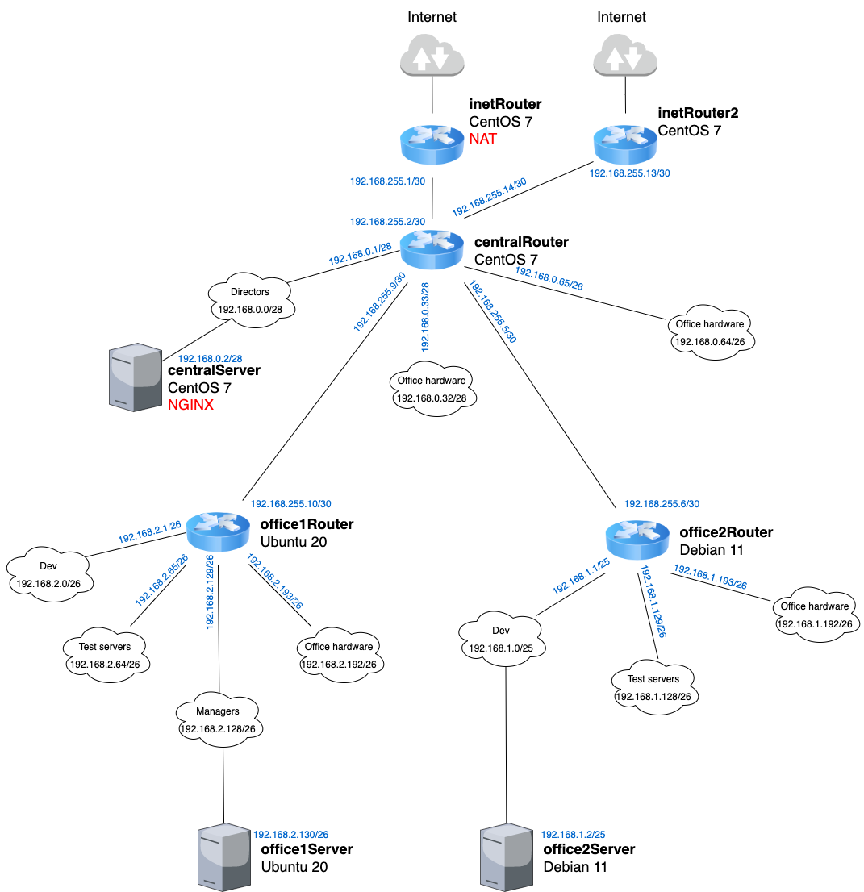

# HW20 - Сценарии iptables

## Задание

- реализовать knocking port (centralRouter может попасть на ssh inetrRouter через knock)
- добавить inetRouter2, который виден (маршрутизируется (host-only тип сети для виртуалки)) с хоста или форвардится порт через локалхост
- запустить nginx на centralServer
- пробросить 80й порт на inetRouter2 8080
- дефолт в инет оставить через inetRouter

## Выполнение

Схема сети



Доработаем наш Ansible playbook добавив:

- knocking port для доступа по ssh с сentralRouter на inetRouter с помощью Knock
- nginx на centralServer на порту 8080
- inetRoute2 для доступа снаружи по 80 порту
- пробросим порт хоста 8080 на гостевой порт 80 inetRouter2

## Проверка

Для проверки доступности nginx выполним локально на ПК: **curl localhost:8080**

```html
<!DOCTYPE html>
<html>
<head>
<title>Welcome to nginx!</title>
<style>
html { color-scheme: light dark; }
body { width: 35em; margin: 0 auto;
font-family: Tahoma, Verdana, Arial, sans-serif; }
</style>
</head>
<body>
<h1>Welcome to nginx!</h1>
<p>If you see this page, the nginx web server is successfully installed and
working. Further configuration is required.</p>

<p>For online documentation and support please refer to
<a href="http://nginx.org/">nginx.org</a>.<br/>
Commercial support is available at
<a href="http://nginx.com/">nginx.com</a>.</p>

<p><em>Thank you for using nginx.</em></p>
</body>
</html>
```

Настройки для Knock:

```bash
[options]
        logfile = /var/log/knockd.log
        interface = eth1
[openSSH]
        sequence = 7000,8000,9000
        seq_timeout = 30
        tcpflags = syn
        command = /sbin/iptables -I INPUT -s %IP% -p tcp --dport 22 -j ACCEPT
[closeSSH]
        sequence = 7001,8001,9001
        seq_timeout = 30
        tcpflags = syn
        command = /sbin/iptables -D INPUT -s %IP% -p tcp --dport 22 -j ACCEPT
```

Для проверки работоспособности **knocking port** зайдем на ВМ centralRouter и скопируем на него приватный ключ для доступа к inetRouter

- На centralRouter уже установлен клиент knock для удобства
- Проверим, что достук по ssh к inetRouter отсутствует: **ssh vagrant@192.168.255.1**
- Далее введем: **knock 192.168.255.1 7000 8000 9000** и снова попробуем выполнить **ssh vagrant@192.168.255.1**
- Успех!
- После окончания работ на inetRouter, закроем порт 22 выполнив на centralRouter: **knock 192.168.255.1 7001 8001 9001**
- Проверим, что доступ к inetRouter отсутствует: **ssh vagrant@192.168.255.1**
