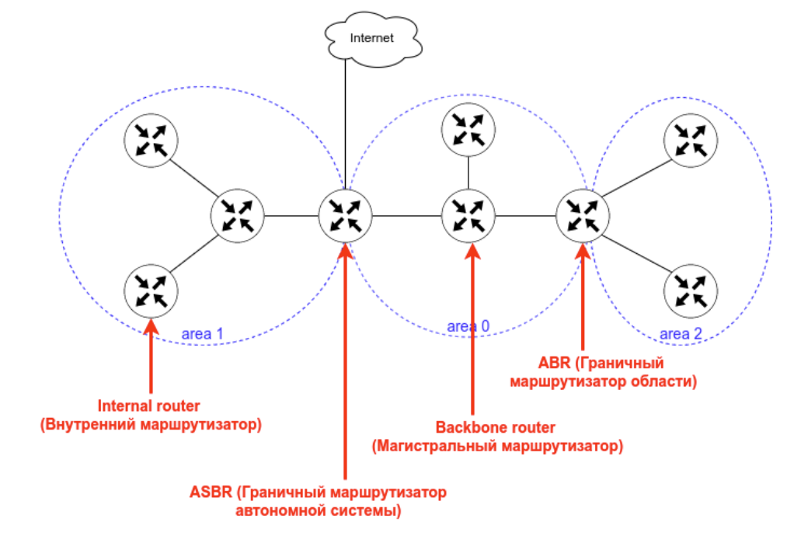
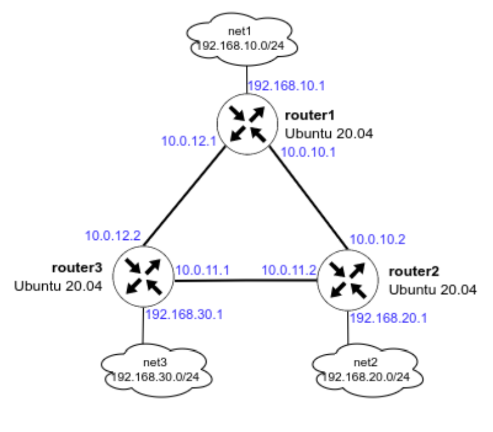
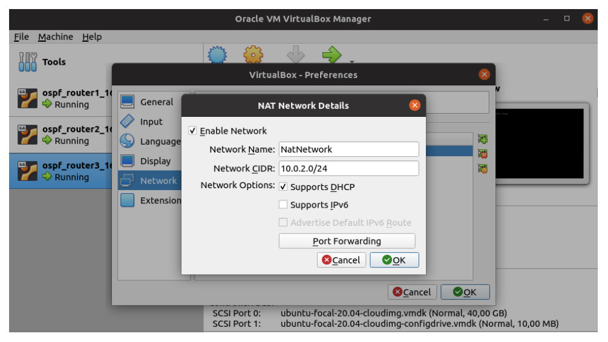

# HW21 - OSPF

## Введение

OSPF — протокол динамической маршрутизации, использующий концепцию разделения на области в целях масштабирования.

Административная дистанция OSPF — 110

Основные свойства протокола OSPF:

- Быстрая сходимость
- Масштабируемость (подходит для маленьких и больших сетей)
- Безопасность (поддежка аутентиикации)
- Эффективность (испольование алгоритма поиска кратчайшего пути)

При настроенном OSPF маршрутизатор формирует таблицу топологии с использованием результатов вычислений, основанных на алгоритме кратчайшего пути (SPF) Дейкстры. Алгоритм поиска кратчайшего пути основывается на данных о совокупной стоимости доступа к точке назначения. Стоимость доступа определятся на основе скорости интерфейса.

Чтобы повысить эффективность и масштабируемость OSPF, протокол поддерживает иерархическую маршрутизацию с помощью областей (area).

Область OSPF (area) — Часть сети, которой ограничивается формирование базы данных о состоянии каналов. Маршрутизаторы, находящиеся в одной и той же области, имеют одну и ту же базу данных о топологии сети. Для определения областей применяются идентификаторы областей.

Протоколы OSPF бвывают 2-х версий:

- OSPFv2
- OSPFv3

Основным отличием протоколов является то, что OSPFv2 работает с IPv4, а OSPFv3 — c IPv6.

Маршрутизаторы в OSPF классифицируются на основе выполняемой ими функции:



- Internal router (внутренний маршрутизатор) — маршрутизатор, все интерфейсы которого находятся в одной и той же области.
- Backbone router (магистральный маршрутизатор) — это маршрутизатор, который находится в магистральной зоне (area 0).
- ABR (пограничный маргрутизатор области) — маршрутизатор, интерфейсы которого подключены к разным областям.
- ASBR (Граничный маршрутизатор автономной системы) — это маршрутизатор, у которого интерфейс подключен к внешней сети.

Также с помощью OSPF можно настроить ассиметричный роутинг.

Ассиметричная маршрутизация — возможность пересекать сеть в одном направлении, используя один путь, и возвращаться через другой путь.

## Цели домашнего задания

Создать домашнюю сетевую лабораторию. Научится настраивать протокол OSPF в Linux-based системах.

## Описание домашнего задания

1. Развернуть 3 виртуальные машины
2. Объединить их разными vlan

- настроить OSPF между машинами на базе Quagga;
- изобразить ассиметричный роутинг;
- сделать один из линков "дорогим", но что бы при этом роутинг был симметричным.

Формат сдачи: Vagrantfile + ansible

Функциоанльные и нефункциональные требования

- ПК на Unix c 8 ГБ ОЗУ или виртуальная машина с включенной Nested Virtualization.

Предварительно установленное и настроенное следующее ПО:

- Hashicorp Vagrant (https://www.vagrantup.com/downloads)
- Oracle VirtualBox (https://www.virtualbox.org/wiki/Linux_Downloads).
- Ansible (версия 2.8 и выше) - <https://docs.ansible.com/ansible/latest/installation_guide/intro_installation.html>
- Любой редактор кода, например Visual Studio Code, Atom и т.д.

## Пошаговая инструкция выполнения домашнего задания

Все дальнейшие действия были проверены при использовании Vagrant 2.2.19, VirtualBox v6.1.26 r145957. В качестве ОС на хостах установлена Ubuntu 20.04.  
Серьёзные отступления от этой конфигурации могут потребовать адаптации с вашей стороны.

### Разворачиваем 3 виртуальные машины

Так как мы планируем настроить OSPF, все 3 виртуальные машины должны быть соединены между собой (разными VLAN), а также иметь одну (или несколько) доолнительных сетей, к которым, далее OSPF сформирует маршруты. Исходя из данных требований, мы можем нарисовать топологию сети:



Обратите внимание, сети, указанные на схеме не должны использоваться в Oracle Virtualbox, иначе Vagrant не сможет собрать стенд и зависнет. По умолчанию Virtualbox использует сеть 10.0.2.0/24. Если была настроена другая сеть, то проверить её можно в настройках программы: **VirtualBox — File — Preferences — Network — щёлкаем по созданной сети**



Создаём каталог, в котором будут храниться настройки виртуальной машины. В каталоге создаём файл с именем Vagrantfile, добавляем в него следующее содержимое:

```ruby
MACHINES = {
    :router1 => {
        :box_name => "ubuntu/focal64",
        :vm_name => "router1",
        :net => [
            {ip: '10.0.10.1', adapter: 2, netmask: "255.255.255.252", virtualbox__intnet: "r1-r2"},
            {ip: '10.0.12.1', adapter: 3, netmask: "255.255.255.252", virtualbox__intnet: "r1-r3"},
            {ip: '192.168.10.1', adapter: 4, netmask: "255.255.255.0",  virtualbox__intnet: "net1"},
            {ip: '192.168.50.10', adapter: 5},  
        ]
    },

    :router2 => {
        :box_name => "ubuntu/focal64",
        :vm_name => "router2",
        :net => [
            {ip: '10.0.10.2', adapter: 2, netmask: "255.255.255.252", virtualbox__intnet: "r1-r2"},
            {ip: '10.0.11.2', adapter: 3, netmask: "255.255.255.252", virtualbox__intnet: "r2-r3"},
            {ip: '192.168.20.1', adapter: 4, netmask: "255.255.255.0", virtualbox__intnet: "net2"},
            {ip: '192.168.50.11', adapter: 5},
        ]
    },

    :router3 => {
        :box_name => "ubuntu/focal64",
        :vm_name => "router3",
        :net => [
            {ip: '10.0.11.1', adapter: 2, netmask: "255.255.255.252", virtualbox__intnet: "r2-r3"},
            {ip: '10.0.12.2', adapter: 3, netmask: "255.255.255.252", virtualbox__intnet: "r1-r3"},
            {ip: '192.168.30.1', adapter: 4, netmask: "255.255.255.0",  virtualbox__intnet: "net3"},
            {ip: '192.168.50.12', adapter: 5},
        ]
    }
}

Vagrant.configure("2") do |config|
    MACHINES.each do |boxname, boxconfig|
        config.vm.define boxname do |box|
            box.vm.box = boxconfig[:box_name]
            box.vm.host_name = boxconfig[:vm_name]

            if boxconfig[:vm_name] == "router3"
                box.vm.provision "ansible" do |ansible|
                    ansible.playbook = "ansible/provision.yml"
                    ansible.inventory_path = "ansible/hosts"
                    ansible.host_key_checking = "false"
                    ansible.limit = "all"
                end
            end

            boxconfig[:net].each do |ipconf|
                box.vm.network "private_network", ipconf
            end
        end
    end
end
```

В данный Vagrantfile уже добавлен модуль запуска Ansible-playbook.

После создания данного файла, из терминала идём в каталог, в котором лежит данный Vagrantfile и вводим команду vagrant up

Результатом выполнения данной команды будут 3 созданные виртуальные машины, которые соединены между собой сетями (10.0.10.0/30, 10.0.11.0/30 и 10.0.12.0/30). У каждого роутера есть дополнительная сеть:

- на router1 — 192.168.10.0/24
- на router2 — 192.168.20.0/24
- на router3 — 192.168.30.0/24

На данном этапе ping до дополнительных сетей (192.168.10-30.0/24) с соседних роутеров будет недоступен.

Для подключения к ВМ нужно ввести команду vagrant ssh <имя машины>, например vagrant ssh router1

Далее потребуется переключиться в root пользователя: sudo -i

Далее все примеры команд будут указаны от пользователя root.

### Первоначальная настройка Ansible

Для настроки хостов с помощью Ansible нам нужно создать несколько файлов и  положить их в отдельную папку (в моём примере имя папки ansible):

#### Конфигурационный файл: ansible.cfg — файл описывает базовые настройки для работы Ansible:

```bash
[defaults]
# Отключение проверки ключа хоста
host_key_checking = false
# Указываем имя файла инвентаризации
inventory = hosts
# Отключаем игнорирование предупреждений
command_warnings= false
```

#### Файл инвентаризации hosts — данный файл хранит информацию о том, как подключиться к хосту:

```bash
[routers]
router1 ansible_host=192.168.50.10 ansible_user=vagrant ansible_ssh_private_key_file=.vagrant/machines/router1/virtualbox/private_key
router2 ansible_host=192.168.50.11 ansible_user=vagrant ansible_ssh_private_key_file=.vagrant/machines/router2/virtualbox/private_key
router3 ansible_host=192.168.50.12 ansible_user=vagrant ansible_ssh_private_key_file=.vagrant/machines/router3/virtualbox/private_key
```

- [servers] - в квадратных скобках указана группа хостов
- router1 — имя нашего хоста (имена хостов и групп не могут быть одинаковые)
- ansible_host — адрес нашего хоста
- ansible_user — имя пользователя, с помощью которого Ansible будет подключаться к хосту
- ansible_ssh_private_key — адрес расположения ssh-ключа
- В файл инвентаризации также можно добовлять переменные, которые могут автоматически добавляться в jinja template. Добавление переменных будет рассмотрено далее.

#### Ansible-playbook provision.yml — основной файл, в котором содержатся инструкции (модули) по настройке для Ansible

#### Дополнительно можно создать каталоги для темплейтов конфигурационных файлов (templates) и файлов с переменными (defaults)

### Установка пакетов для тестирования и настройки OSPF

Перед настройкой FRR рекомендуется поставить базовые программы для изменения конфигурационных файлов (vim) и изучения сети (traceroute, tcpdump, net-tools):

```bash
apt update
apt install vim traceroute tcpdump net-tools
```

Пример установки пакетов с помощью Ansible

```yml
---
# Начало файла provision.yml
- name: OSPF
  # У казываем имя хоста или группу, которые будем настраивать
  hosts: all
  # Параметр выполнения модулей от root-пользователя
  become: true
  # Указание файла с дополнителыми переменными (понадобится при добавлении темплейтов)
  vars_files:
    - defaults/main.yml
  tasks:
    # Обновление пакетов и установка vim, traceroute, tcpdump, net-tools
    - name: install base tools
      apt:
        name:
          - vim
          - traceroute
          - tcpdump
          - net-tools
        state: present
        update_cache: true
```

### Настройка OSPF между машинами на базе Quagga

Пакет Quagga перестал развиваться в 2018 году. Ему на смену пришёл пакет FRR, он построен на базе Quagga и продолжает своё развитие. В данном руководстве настойка OSPF будет осуществляться в FRR.

Процесс установки FRR и настройки OSPF вручную:

- Отключаем файерволл ufw и удаляем его из автозагрузки:

```bash
systemctl stop ufw
systemctl disable ufw
```

- Добавляем gpg ключ:

```bash
curl -s https://deb.frrouting.org/frr/keys.asc | sudo apt-key add -
```

- Добавляем репозиторий c пакетом FRR:

```bash
echo deb https://deb.frrouting.org/frr $(lsb_release -s -c) frr-stable > /etc/apt/sources.list.d/frr.list
```

- Обновляем пакеты и устанавливаем FRR:

```bash
sudo apt update
sudo apt install frr frr-pythontools
```

- Разрешаем (включаем) маршрутизацию транзитных пакетов:

```bash
sysctl net.ipv4.conf.all.forwarding=1
```

- Включаем демон ospfd в FRR

Для этого открываем в редакторе файл /etc/frr/daemons и меняем в нём параметры для пакетов zebra и ospfd на yes:

/etc/frr/daemons

```bash
zebra=yes
ospfd=yes
bgpd=no
ospf6d=no
ripd=no
ripngd=no
isisd=no
pimd=no
ldpd=no
nhrpd=no
eigrpd=no
babeld=no
sharpd=no
pbrd=no
bfdd=no
fabricd=no
vrrpd=no
pathd=no
```

> В примере показана только часть файла

- Настройка OSPF

Для настройки OSPF нам потребуется создать файл /etc/frr/frr.conf который будет содержать в себе информацию о требуемых интерфейсах и OSPF. Разберем пример создания файла на хосте router1.

Для начала нам необходимо узнать имена интерфейсов и их адреса. Сделать это можно с помощью двух способов:

- Посмотреть в linux: ip a | grep inet

```bash
root@router1:~# ip a | grep "inet "
    inet 127.0.0.1/8 scope host lo
    inet 10.0.2.15/24 brd 10.0.2.255 scope global dynamic enp0s3
    inet 10.0.10.1/30 brd 10.0.10.3 scope global enp0s8
    inet 10.0.12.1/30 brd 10.0.12.3 scope global enp0s9
    inet 192.168.10.1/24 brd 192.168.10.255 scope global enp0s10
    inet 192.168.50.10/24 brd 192.168.50.255 scope global enp0s16
root@router1:~#
```

- Зайти в интерфейс FRR и посмотреть информацию об интерфейсах

```bash
root@router1:~# vtysh
Hello, this is FRRouting (version 8.1).

Copyright 1996-2005 Kunihiro Ishiguro, et al.

router1# show interface brief
Interface Status VRF Addresses
--------- ------ --- ---------
enp0s3 up default 10.0.2.15/24
enp0s8 up default 10.0.10.1/30
enp0s9 up default 10.0.12.1/30
enp0s10 up default 192.168.10.1/24
enp0s16 up default 192.168.50.10/24
lo up default

router1# exit
root@router1:~#
```

В обоих примерах мы увидем имена сетевых интерфейсов, их ip-адреса и маски подсети. Исходя из схемы мы понимаем, что для настройки OSPF нам достаточно описать интерфейсы enp0s8, enp0s9, enp0s10

Создаём файл /etc/frr/frr.conf и вносим в него следующую информацию:

```bash
!Указание версии FRR
frr version 8.1
frr defaults traditional
!Указываем имя машины
hostname router1
log syslog informational
no ipv6 forwarding
service integrated-vtysh-config
!
!Добавляем информацию об интерфейсе enp0s8
interface enp0s8
  !Указываем имя интерфейса
  description r1-r2
  !Указываем ip-aдрес и маску (эту информацию мы получили в прошлом шаге)
  ip address 10.0.10.1/30
  !Указываем параметр игнорирования MTU
  ip ospf mtu-ignore
  !Если потребуется, можно указать «стоимость» интерфейса
  !ip ospf cost 1000
  !Указываем параметры hello-интервала для OSPF пакетов
  ip ospf hello-interval 10
  !Указываем параметры dead-интервала для OSPF пакетов
  !Должно быть кратно предыдущему значению
  ip ospf dead-interval 30
!
interface enp0s9
  description r1-r3
  ip address 10.0.12.1/30
  ip ospf mtu-ignore
  !ip ospf cost 45
  ip ospf hello-interval 10
  ip ospf dead-interval 30
!  
interface enp0s10
  description net_router1
  ip address 192.168.10.1/24
  ip ospf mtu-ignore
  !ip ospf cost 45
  ip ospf hello-interval 10
  ip ospf dead-interval 30
!
!Начало настройки OSPF
router ospf
  !Указываем router-id
  router-id 1.1.1.1
  !Указываем сети, которые хотим анонсировать соседним роутерам
  network 10.0.10.0/30 area 0
  network 10.0.12.0/30 area 0
  network 192.168.10.0/24 area 0
  !Указываем адреса соседних роутеров
  neighbor 10.0.10.2
  neighbor 10.0.12.2
!  
!Указываем адрес log-файла
log file /var/log/frr/frr.log
default-information originate always
```

Сохраняем изменения и выходим из данного файла.

Вместо файла frr.conf мы можем задать данные параметры вручную из vtysh. Vtysh использует cisco-like команды.

На хостах router2 и router3 также потребуется настроить конфигруационные файлы, предварительно поменяв ip -адреса интерфейсов.

В ходе создания файла мы видим несколько OSPF-параметров, которые требуются для настройки:

- hello-interval — интервал который указывает через сколько секунд протокол OSPF будет повторно отправлять запросы на другие роутеры. Данный интервал должен быть одинаковый на всех портах и роутерах, между которыми настроен OSPF.
- Dead-interval — если в течении заданного времени роутер не отвечает на запросы, то он считается вышедшим из строя и пакеты уходят на другой роутер (если это возможно). Значение должно быть кратно hello-интервалу. Данный интервал должен быть одинаковый на всех портах и роутерах, между которыми настроен OSPF.
- router-id — идентификатор маршрутизатора (необязательный параметр), если данный параметр задан, то роутеры определяют свои роли по данному параметру. Если данный идентификатор не задан, то роли маршрутизаторов определяются с помощью Loopback-интерфейса или самого большого ip-адреса на роутере.

- После создания файлов /etc/frr/frr.conf и /etc/frr/daemons нужно проверить, что владельцем файла является пользователь frr. Группа файла также должна быть frr. 

Должны быть установленны следующие права:

- у владельца на чтение и запись
- у группы только на чтение

```bash
ls -l /etc/frr
```

Если права или владелец файла указан неправильно, то нужно поменять владельца и назначить правильные права, например:

```bash
chown frr:frr /etc/frr/frr.conf
chmod 640 /etc/frr/frr.conf
```

- Перезапускаем FRR и добавляем его в автозагрузку

```bash
systemct restart frr
systemctl enable frr
```

- Проверям, что OSPF перезапустился без ошибок

```bash
systemctl status frr
```

Если мы правильно настроили OSPF, то с любого хоста нам должны быть доступны сети:

- 192.168.10.0/24
- 192.168.20.0/24
- 192.168.30.0/24
- 10.0.10.0/30
- 10.0.11.0/30
- 10.0.13.0/30

Проверим доступность сетей с хоста router1:

- попробуем сделать ping до ip-адреса 192.168.30.1

```bash
root@router1:~# ping 192.168.30.1
```

- Запустим трассировку до адреса 192.168.30.1

```bash
root@router1:~# traceroute 192.168.30.1
```

Попробуем отключить интерфейс enp0s9 и немного подождем и снова запустим трассировку до ip-адреса 192.168.30.1

```bash
root@router1:~# ifconfig enp0s9 down
root@router1:~# ip a | grep enp0s9
4: enp0s9: <BROADCAST,MULTICAST> mtu 1500 qdisc fq_codel state DOWN group
default qlen 1000
root@router1:~# traceroute 192.168.30.1
traceroute to 192.168.30.1 (192.168.30.1), 30 hops max, 60 byte packets
1 10.0.10.2 (10.0.10.2) 0.522 ms 0.479 ms 0.460 ms
2 192.168.30.1 (192.168.30.1) 0.796 ms 0.777 ms 0.644 ms
root@router1:~#
```

Как мы видим, после отключения интерфейса сеть 192.168.30.0/24 нам остаётся доступна.

Также мы можем проверить из интерфейса vtysh какие маршруты мы видим на данный момент:

```bash
root@router1:~#
root@router1:~# vtysh
```

Настройка OSPF c помощью Ansible:

```yml
    # Отключаем UFW и удаляем его из автозагрузки
    - name: disable ufw service
      service:
        name: ufw
        state: stopped
        enabled: false
    # Добавляем gpg-key репозитория
    - name: add gpg frrouting.org
      apt_key:
        url: "https://deb.frrouting.org/frr/keys.asc"
        state: present
    # Добавляем репозиторий https://deb.frrouting.org/frr
    - name: add frr repo
      apt_repository:
        repo: 'deb https://deb.frrouting.org/frr {{ ansible_distribution_release }} frr-stable'
        state: present
    # Обновляем пакеты и устанавливаем FRR
    - name: install FRR packages
      apt:
        name:
          - frr
          - frr-pythontools
        state: present
        update_cache: true
    # Включаем маршрутизацию транзитных пакетов
    - name: set up forward packages across routers
      sysctl:
        name: net.ipv4.conf.all.forwarding
        value: '1'
        state: present
    # Копируем файл daemons на хосты, указываем владельца и права
    - name: base set up OSPF
      template:
        src: daemons
        dest: /etc/frr/daemons
        owner: frr
        group: frr
        mode: 0640
    # Копируем файл frr.conf на хосты, указываем владельца и права
    - name: set up OSPF
      template:
        src: frr.conf.j2
        dest: /etc/frr/frr.conf
        owner: frr
        group: frr
        mode: 0640
    # Перезапускам FRR и добавляем в автозагрузку
    - name: restart FRR
      service:
        name: frr
        state: restarted
        enabled: true
```

Файлы daemons и frr.conf должны лежать в каталоге ansible/template.

Давайте подробнее рассмотрим эти файлы. Содержимое файла daemons одинаково на всех хостах, а вот содержание файла frr.conf на всех хостах будет разное.

Для того, чтобы не создавать 3 похожих файла, можно воспользоваться jinja2 template. Jinja2 позволит добавлять в файл уникальные значения для разных серверов.

Перед тем, как начать настройку хостов Ansible забирает информацию о каждом хосте. Эту информацию можно использовать в jinja2 темплейтах.

Посмотреть, какую информацию о сервере собрал Ansible можно с помощью команды:

```bash
ansible router1 -i ansible/hosts -m setup -e "host_key_checking = false"
```

Команда выполнятся из каталога проекта (где находится Vagrantfile).

Помимо фактов Jinja2 может брать информацию из файлов hosts и defaults/main.yml (так как мы указали его в начале файла provision.yml)

Примеры использования jinja2:

- В файле frr.conf у нас есть строка:

hostname router1

Когда мы будем копировать файл на router2 и router3 нам нужно будет поменять имя. Сделать это можно так: hostname {{ ansible_hostname }}

ansible_hostname - заберет из фактов имя хостов и подставит нужное имя

- Допустим мы хотим перед настройкой OSPF выбрать, будем ли мы указывать router-id. Для этого в файле defaults/main.yml создаем переменную router_id_enable: false

По умолчанию назначаем ей значение **false**

Значение router_id мы можем задать в файле hosts, дописав его в конец строки наших хостов:

```bash
[routers]
router1 ansible_host=192.168.50.10 ansible_user=vagrant ansible_ssh_private_key_file=.vagrant/machines/router1/virtualbox/private_key router_id=1.1.1.1
router2 ansible_host=192.168.50.11 ansible_user=vagrant ansible_ssh_private_key_file=.vagrant/machines/router2/virtualbox/private_key router_id=2.2.2.2
router3 ansible_host=192.168.50.12 ansible_user=vagrant ansible_ssh_private_key_file=.vagrant/machines/router3/virtualbox/private_key router_id=3.3.3.3
```

В темплейте файла frr.conf укажем следующее условие:

```bash
!router-id {{ router_id }}
```

Данное правило в любом случае будет подставлять значение router-id, но, если параметр router_id_enable будет равен значению false, то в начале строки будет ставиться символ ! (восклицательный знак) и строка не будет учитываться в настройках FRR.

Более подробно о создании темплейтов можно прочитать по этой ссылке - <https://docs.ansible.com/ansible/2.9/user_guide/playbooks_templating.html>

### Настройка ассиметричного роутинга

Для настройки ассиметричного роутинга нам необходимо выключить блокировку ассиметричной маршрутизации: sysctl net.ipv4.conf.all.rp_filter=0

Далее, выбираем один из роутеров, на котором изменим «стоимость интерфейса». Например поменяем стоимость интерфейса enp0s8 на router1:

```bash
root@router1:~# vtysh

Hello, this is FRRouting (version 8.1).
Copyright 1996-2005 Kunihiro Ishiguro, et al.

router1# conf t
int enp0s8
router1(config-if)# ip ospf cost 1000
router1(config-if)# exit
router1(config)# exit
router1# show ip route ospf

show ip route ospf
```

После внесения данных настроек, мы видим, что маршрут до сети 192.168.20.0/30 теперь пойдёт через router2, но обратный трафик от router2 пойдёт по другому пути. 

Давайте это проверим:

- На router1 запускаем пинг от 192.168.10.1 до 192.168.20.1: ping -I 192.168.10.1 192.168.20.1
- На router2 запускаем tcpdump, который будет смотреть трафик только на порту enp0s9:

```bash
root@router2:~# tcpdump -i enp0s9
tcpdump: verbose output suppressed, use -v or -vv for full protocol
decode
listening on enp0s9, link-type EN10MB (Ethernet), capture size 262144
bytes
19
19:03:00.185258 IP 192.168.10.1 > router2: ICMP echo request, id 6, seq
108, length 64
19:03:01.186977 IP 192.168.10.1 > router2: ICMP echo request, id 6, seq
109, length 64
19:03:02.188563 IP 192.168.10.1 > router2: ICMP echo request, id 6, seq
110, length 64
19:03:02.540289 IP router2 > ospf-all.mcast.net: OSPFv2, Hello, length 48
19:03:02.542198 IP 10.0.11.1 > ospf-all.mcast.net: OSPFv2, Hello, length
48
19:03:03.189952 IP 192.168.10.1 > router2: ICMP echo request, id 6, seq
111, length 64
```

> Видим что данный порт только получает ICMP-трафик с адреса 192.168.10.1

На router2 запускаем tcpdump, который будет смотреть трафик только на порту enp0s8:

```bash
root@router2:~# tcpdump -i enp0s8
tcpdump: verbose output suppressed, use -v or -vv for full protocol
decode
listening on enp0s8, link-type EN10MB (Ethernet), capture size 262144
bytes
19:05:24.410547 IP router2 > 192.168.10.1: ICMP echo reply, id 6, seq
248, length 64
19:05:25.461411 IP router2 > 192.168.10.1: ICMP echo reply, id 6, seq
249, length 64
19:05:26.496036 IP router2 > 192.168.10.1: ICMP echo reply, id 6, seq
250, length 64
19:05:27.498524 IP router2 > 192.168.10.1: ICMP echo reply, id 6, seq
251, length 64
```

> Видим что данный порт только отправляет ICMP-трафик на адрес 192.168.10.1

Таким образом мы видим ассиметричный роутинг.

Настройка ассиметричного роутинга с помощью Ansible

```yml
    # Отключаем запрет ассиметричного роутинга
    - name: set up asynchronous routing
      sysctl:
        name: net.ipv4.conf.all.rp_filter
        value: '0'
        state: present
    # Делаем интерфейс enp0s8 в router1 «дорогим»
    - name: set up OSPF
      template:
        src: frr.conf.j2
        dest: /etc/frr/frr.conf
        owner: frr
        group: frr
        mode: 0640
    # Применяем настройки
    - name: restart FRR
      service:
        name: frr
        state: restarted
        enabled: true
```

Пример добавления «дорогого» интерфейса в template frr.conf

```bash

ip ospf cost 1000

!ip ospf cost 450

```

В данном примере, проверяется имя хоста, и, если имя хоста «router1», то в настройку интерфейса enp0s8 добавляется стоимость 1000, в остальных случаях настройка комментируется…

### Настройка симметичного роутинга

Так как у нас уже есть один «дорогой» интерфейс, нам потребуется добавить ещё один дорогой интерфейс, чтобы у нас перестала работать ассиметричная маршрутизация.

Так как в прошлом задании мы заметили что router2 будет отправлять обратно трафик через порт enp0s8, мы также должны сделать его дорогим и далее проверить, что теперь используется симметричная маршрутизация:

Поменяем стоимость интерфейса enp0s8 на router2:

```bash
router2# conf t
router2(config)# int enp0s8
router2(config-if)# ip ospf cost 1000
router2(config-if)# exit
router2(config)# exit
router2#
router2# show ip route ospf
Codes: K - kernel route, C - connected, S - static, R - RIP,
O - OSPF, I - IS-IS, B - BGP, E - EIGRP, N - NHRP,
T - Table, v - VNC, V - VNC-Direct, A - Babel, F - PBR,
f - OpenFabric,
> - selected route, * - FIB route, q - queued, r - rejected, b - backup
t - trapped, o - offload failure
```

После внесения данных настроек, мы видим, что маршрут до сети 192.168.10.0/30 пойдёт через router2.

Давайте это проверим:

- На router1 запускаем пинг от 192.168.10.1 до 192.168.20.1: ping -I 192.168.10.1 192.168.20.1
- На router2 запускаем tcpdump, который будет смотреть трафик только на порту enp0s9:

```bash
tcpdump -i enp0s9
tcpdump: verbose output suppressed, use -v or -vv for full protocol
decode
listening on enp0s9, link-type EN10MB (Ethernet), capture size 262144
bytes
19:30:28.551713 IP 192.168.10.1 > router2: ICMP echo request, id 6, seq
1737, length 64
19:30:28.551801 IP router2 > 192.168.10.1: ICMP echo reply, id 6, seq
```

> Теперь мы видим, что трафик между роутерами ходит симметрично.

Настройка симметричного роутинга с помощью Ansible

Настройка симметричного роутинга заключается в том, чтобы добавить правильную настройку в файл /etc/frr/frr.conf

Далее, файл необходимо также отправить на хосты и перезапустить FRR.

Чтобы было легко переключаться между ассиметричным и симметричным роутингом, мы можем добавить переменную symmetric_routing со значением по умолчанию false в файл defaults/main.yml

symmetric_routing: false

Далее в template frr.conf добавим условие:

```bash

ip ospf cost 1000

ip ospf cost 1000

!ip ospf cost 450

```

Данное условие проверят имя хоста и переменную symmetric_routing и добавляет в темплейт следующие параметры:

- Если имя хоста router1 — то добавляется стоимость интерфейса 1000
- Если имя хоста router2 И значение параметра symmetric_routing true — то добавляется стоимость интерфейса 1000
- В остальных случаях добавляется закомментированный параметр

Для удобного переключения параметров нам потребуется запускать из ansible-playbook только 2 последних модуля. Чтобы не ждать выполнения всего плейбука, можно добавить тег к модулям:

```bash
    - name: set up OSPF
      template:
        src: frr.conf.j2
        dest: /etc/frr/frr.conf
        owner: frr
        group: frr
        mode: 0640
      tags:
        - setup_ospf
    - name: restart FRR
      service:
        name: frr
        state: restarted
        enabled: true
      tags:
        - setup_ospf
```

Тогда можно будет запускать playbook не полностью. Пример запуска модулей из ansible-playbook, которые помечены тегами:

```bash
ansible-playbook -i ansible/hosts -l all ansible/provision.yml -t setup_ospf -e "host_key_checking=false"
```

## Рекомендуемые источники

- [Статья «OSPF»](https://ru.bmstu.wiki/OSPF_(Open_Shortest_Path_First)#.D0.A2.D0.B5.D1.80.D0.BC.D0.B8.D0.BD.D1.8B_.D0.B8_.D0.BE.D1.81.D0.BD.D0.BE.D0.B2.D0.BD.D1.8B.D0.B5_.D0.BF.D0.BE.D0.BD.D1.8F.D1.82.D0.B8.D1.8F_OSPF)
- [Статья «IP Routing: OSPF Configuration Guide»](https://www.cisco.com/c/en/us/td/docs/ios-xml/ios/iproute_ospf/configuration/xe-16/iro-xe-16-book/iro-cfg.html)
- [Документация FRR](http://docs.frrouting.org/en/latest/overview.html)
- [Статья «Принципы таблицы маршрутизации. Асимметричная маршрутизация»](http://marshrutizatciia.ru/principy-tablicy-marshrutizacii-asimmetrichnaya-marshrutizaciya.html)
- [Различия межлу протоколами OSPF](https://da2001.ru/CCNA_5.02/2/course/module8/8.3.1.3/8.3.1.3.html#:~:text=%D0%9A%D0%BE%D0%BD%D1%84%D0%B8%D0%B3%D1%83%D1%80%D0%B0%D1%86%D0%B8%D1%8F%20OSPFv3%20%D0%B4%D0%BB%D1%8F%20%D0%BE%D0%B4%D0%BD%D0%BE%D0%B9%20%D0%BE%D0%B1%D0%BB%D0%B0%D1%81%D1%82%D0%B8&text=%D0%98%D1%81%D1%85%D0%BE%D0%B4%D0%BD%D1%8B%D0%B9%20%D0%B0%D0%B4%D1%80%D0%B5%D1%81%20%E2%80%94%20%D1%81%D0%BE%D0%BE%D0%B1%D1%89%D0%B5%D0%BD%D0%B8%D1%8F%20OSPFv2%20%D0%BF%D0%BE%D1%81%D1%82%D1%83%D0%BF%D0%B0%D1%8E%D1%82,%D1%82%D0%B8%D0%BF%D0%B0%20link%2Dlocal%20%D0%B2%D1%8B%D1%85%D0%BE%D0%B4%D0%BD%D0%BE%D0%B3%D0%BE%20%D0%B8%D0%BD%D1%82%D0%B5%D1%80%D1%84%D0%B5%D0%B9%D1%81%D0%B0)
- [Документация по Templating(jinja2)](https://docs.ansible.com/ansible/2.9/user_guide/playbooks_templating.html)
