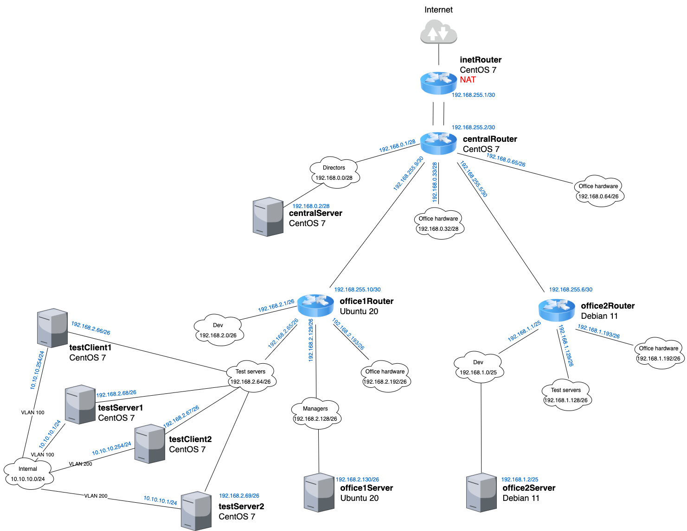

# HW24 - Строим бонды и вланы

## Задание

в Office1 в тестовой подсети появляются сервера с доп интерфесами и адресами в internal сети testLAN

- testClient1 - 10.10.10.254
- testClient2 - 10.10.10.254
- testServer1 - 10.10.10.1
- testServer2 - 10.10.10.1

Развести вланами testClient1 <-> testServer1 и testClient2 <-> testServer2

Между centralRouter и inetRouter "пробросить" 2 линка (общая internal сеть) и объединить их в бонд, проверить работу c отключением интерфейсов

## Выполнение

Доработаем наш Ansible playbook и проверим результат

Схема сети



### VLAN

testClient1 <-> testServer1

```bash
tcpdump -i enp0s9 -n -e
tcpdump: verbose output suppressed, use -v or -vv for full protocol decode
listening on enp0s9, link-type EN10MB (Ethernet), capture size 262144 bytes
23:48:34.048563 08:00:27:89:97:3b > 08:00:27:78:5a:92, ethertype 802.1Q (0x8100), length 102: vlan 100, p 0, ethertype IPv4, 10.10.10.1 > 10.10.10.254: ICMP echo request, id 7, seq 1, length 64
23:48:34.048596 08:00:27:78:5a:92 > 08:00:27:89:97:3b, ethertype 802.1Q (0x8100), length 102: vlan 100, p 0, ethertype IPv4, 10.10.10.254 > 10.10.10.1: ICMP echo reply, id 7, seq 1, length 64
23:48:35.081086 08:00:27:89:97:3b > 08:00:27:78:5a:92, ethertype 802.1Q (0x8100), length 102: vlan 100, p 0, ethertype IPv4, 10.10.10.1 > 10.10.10.254: ICMP echo request, id 7, seq 2, length 64
23:48:35.081124 08:00:27:78:5a:92 > 08:00:27:89:97:3b, ethertype 802.1Q (0x8100), length 102: vlan 100, p 0, ethertype IPv4, 10.10.10.254 > 10.10.10.1: ICMP echo reply, id 7, seq 2, length 64
```

testClient2 <-> testServer2

```bash
tcpdump -i enp0s9 -n -e
tcpdump: verbose output suppressed, use -v or -vv for full protocol decode
listening on enp0s9, link-type EN10MB (Ethernet), capture size 262144 bytes
23:58:29.731625 08:00:27:b9:f9:8d > 08:00:27:b0:96:6b, ethertype 802.1Q (0x8100), length 102: vlan 200, p 0, ethertype IPv4, 10.10.10.1 > 10.10.10.254: ICMP echo request, id 3, seq 1, length 64
23:58:29.731658 08:00:27:b0:96:6b > 08:00:27:b9:f9:8d, ethertype 802.1Q (0x8100), length 102: vlan 200, p 0, ethertype IPv4, 10.10.10.254 > 10.10.10.1: ICMP echo reply, id 3, seq 1, length 64
23:58:30.760817 08:00:27:b9:f9:8d > 08:00:27:b0:96:6b, ethertype 802.1Q (0x8100), length 102: vlan 200, p 0, ethertype IPv4, 10.10.10.1 > 10.10.10.254: ICMP echo request, id 3, seq 2, length 64
23:58:30.760868 08:00:27:b0:96:6b > 08:00:27:b9:f9:8d, ethertype 802.1Q (0x8100), length 102: vlan 200, p 0, ethertype IPv4, 10.10.10.254 > 10.10.10.1: ICMP echo reply, id 3, seq 2, length 64
```

### Bonding

inetRouter: cat /proc/net/bonding/bond0

```bash
Ethernet Channel Bonding Driver: v3.7.1 (April 27, 2011)

Bonding Mode: fault-tolerance (active-backup) (fail_over_mac active)
Primary Slave: None
Currently Active Slave: eth1
MII Status: up
MII Polling Interval (ms): 100
Up Delay (ms): 0
Down Delay (ms): 0

Slave Interface: eth1
MII Status: up
Speed: 1000 Mbps
Duplex: full
Link Failure Count: 0
Permanent HW addr: 08:00:27:e0:81:97
Slave queue ID: 0

Slave Interface: eth2
MII Status: up
Speed: 1000 Mbps
Duplex: full
Link Failure Count: 0
Permanent HW addr: 08:00:27:9c:1f:0c
Slave queue ID: 0
```

centralRouter: cat /proc/net/bonding/bond0

```bash
Ethernet Channel Bonding Driver: v3.7.1 (April 27, 2011)

Bonding Mode: fault-tolerance (active-backup) (fail_over_mac active)
Primary Slave: None
Currently Active Slave: eth1
MII Status: up
MII Polling Interval (ms): 100
Up Delay (ms): 0
Down Delay (ms): 0

Slave Interface: eth3
MII Status: up
Speed: 1000 Mbps
Duplex: full
Link Failure Count: 0
Permanent HW addr: 08:00:27:33:50:75
Slave queue ID: 0

Slave Interface: eth1
MII Status: up
Speed: 1000 Mbps
Duplex: full
Link Failure Count: 0
Permanent HW addr: 08:00:27:d5:7a:9a
Slave queue ID: 0
```

Выполним пинг ip inetRouter с centralRouter и убедимся, что пинг проходит

Далее переключим активный интерфейс на inetRouter: echo eth2 > /sys/class/net/bond0/bonding/active_slave

и на centralRouter: echo eth3 > /sys/class/net/bond0/bonding/active_slave

> В этом случае все интерфейсы останутся в состоянии UP, но их роли (активный/резервный) изменятся

centralRouter: cat /proc/net/bonding/bond0

```bash
Ethernet Channel Bonding Driver: v3.7.1 (April 27, 2011)

Bonding Mode: fault-tolerance (active-backup) (fail_over_mac active)
Primary Slave: None
Currently Active Slave: eth3
MII Status: up
MII Polling Interval (ms): 100
Up Delay (ms): 0
Down Delay (ms): 0

Slave Interface: eth3
MII Status: up
Speed: 1000 Mbps
Duplex: full
Link Failure Count: 0
Permanent HW addr: 08:00:27:33:50:75
Slave queue ID: 0

Slave Interface: eth1
MII Status: up
Speed: 1000 Mbps
Duplex: full
Link Failure Count: 0
Permanent HW addr: 08:00:27:d5:7a:9a
Slave queue ID: 0
```

inetRouter: cat /proc/net/bonding/bond0

```bash
Ethernet Channel Bonding Driver: v3.7.1 (April 27, 2011)

Bonding Mode: fault-tolerance (active-backup) (fail_over_mac active)
Primary Slave: None
Currently Active Slave: eth2
MII Status: up
MII Polling Interval (ms): 100
Up Delay (ms): 0
Down Delay (ms): 0

Slave Interface: eth1
MII Status: up
Speed: 1000 Mbps
Duplex: full
Link Failure Count: 0
Permanent HW addr: 08:00:27:e0:81:97
Slave queue ID: 0

Slave Interface: eth2
MII Status: up
Speed: 1000 Mbps
Duplex: full
Link Failure Count: 0
Permanent HW addr: 08:00:27:9c:1f:0c
Slave queue ID: 0
```

Снова запустим пинг ip inetRouter с centralRouter и убедимся, что пинг проходит
