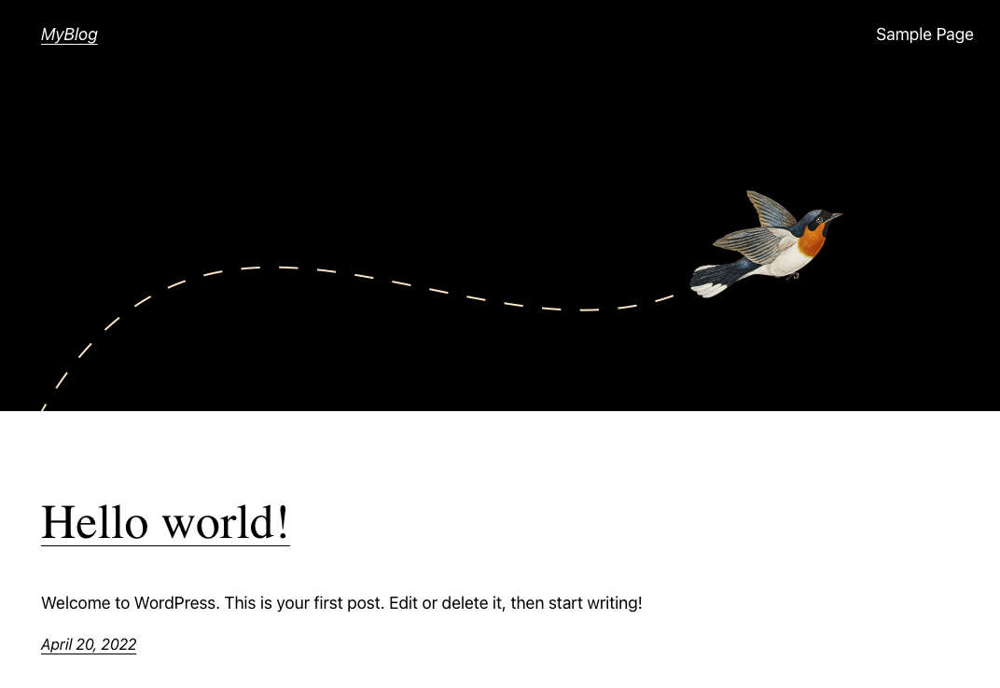

# HW26 - Развертывание веб приложения

## Введение

За последние десятилетия, средняя скорость разработки увеличивается с большой прогрессией от года к году, потому что IT продукты приносят огромные деньги бизнесу практически в любой сфере. Высокая интенсивность породила большое количество методологий, ускоряющих разработку. Также выросли требования к инфраструктуре. Появилась необходимость динамически обновлять, откатывать, масштабировать и резервировать нашу инфраструктуру. В нынешних реалиях, одной из ключевых методологий в построении информационных систем, является - Infrastructure as Code ( Инфраструктура как код, IaC ). Она подразумевает подход для управления и описания инфраструктуры ЦОД через конфигурационные файлы, а не через ручное редактирование конфигураций на серверах или интерактивное взаимодействие. Этот подход может включать в себя как декларативный способ описания инфраструктуры, так и через скрипты.

IaC несёт в себе следующие плюсы:

- Скорость и уменьшение затрат
- Масштабируемость и стандартизация
- Безопасность и документация
- Восстановление в аварийных ситуациях

P.S. Подробнее про IaC, вы можете почитать в статье - https://habr.com/ru/company/otus/blog/574278/

В данной работе, мы применим знания полученные в прошлых уроках и опишем базовую инфраструктуру с помощью конфигураций и манифестов.

## Цели домашнего задания

Получить практические навыки в настройке инфраструктуры с помощью манифестов и конфигураций. Отточить навыки использования ansible/vagrant/docker.

## Описание домашнего задания

Развернем с помошью [Vagrant](./Vagrantfile) + [Ansible](./prov.yml) в контейнерах:

- [nginx](./project/config/nginx.conf) + статика приложения js(react)
- сборка статики приложения js(react)
- uswgi python(flask) через uwsgi_pass unix сокет
- php-fpm (wordpress) через fastcgi unix сокет
- mariadb (wordpress)
- wpcli (wordress) для автонастройки wordpress

```bash
vagrant up
```

После деплоя проверим доступность на различных портах:

- 127.0.0.1:8081 <- wordpress



- 127.0.0.1:8082 <- flask


- 127.0.0.1:8083 -< js


